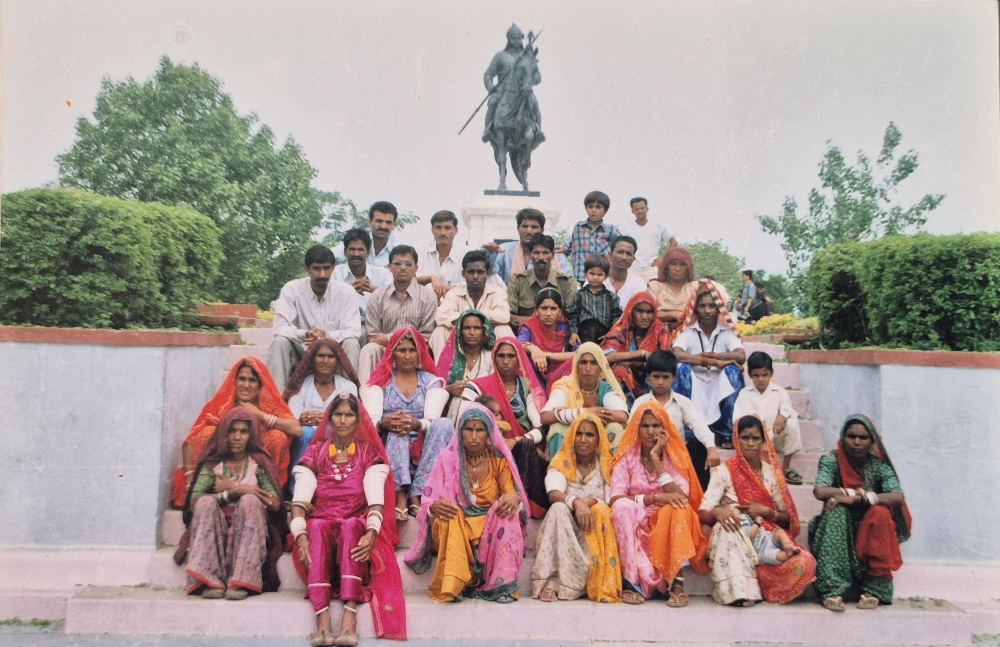

```{=html}
<div class="about-hero">
  <div class="about-hero-inner">
    <h2 class="about-hero-title">About Us</h2>
  </div>
</div>

<div class="focus-wrapper">
  <div class="about-container">
    <div class="about-intro-text reveal">
      <h3>Vasundhara Sewa Samiti</h1>
      <div class="focus-subtitle-wrapper">
        <p><strong>Registered under the Rajasthan State Cooperative/Societies Act, 1958, Vasundhara Sewa Samiti is a non-governmental, non-profit organization working in the rural and drought-prone regions of Balotra district, Rajasthan.</strong></p>
        <p>Founded with the objective of addressing deep-rooted socio-economic challenges, Vasundhara Sewa Samiti works to empower women, youth, children, scheduled castes, and economically weaker sections by strengthening their capacities, awareness, and access to rights and resources. The organization believes that sustainable development is possible only when communities are enabled to take charge of their own lives and development processes.</p>
        <p>Guided by participatory and rights-based approaches, the Samiti implements need-based and locally relevant development interventions in the areas of livelihood promotion, education, disaster risk reduction, institutional development, community capacity building, environmental awareness, and access to government welfare schemes. The organization actively collaborates with government departments, local self-governments, community-based organizations, and civil society partners to ensure inclusive and long-term impact.</p>
        <p>Vasundhara Sewa Samiti strives to improve the quality of life of rural communities by promoting sustainable livelihoods, social justice, and informed citizenship. By combining traditional community knowledge with practical development strategies, the organization contributes towards inclusive growth and aligns its work with national priorities and the Sustainable Development Goals (SDGs).</p>
      </div>
    </div>
    <div class="about-intro-image reveal">
      
    </div>
  </div>

  <div class="vss-focus-band reveal" style="background-color: #f9f9f9;">
    <div class="vss-focus-band-inner">
      <div class="row">
        <div class="col-md-6 mb-4">
          <h3 style="color: #1a5c2a; font-weight: 700; margin-bottom: 20px;">Our Vision & Mission</h3>
          <p style="color: #555; line-height: 1.8;">Vasundhara Sewa Samiti strives to improve the quality of life of rural communities by promoting sustainable livelihoods, social justice, and informed citizenship. By combining traditional community knowledge with practical development strategies, the organization contributes towards inclusive growth and aligns its work with national priorities and the Sustainable Development Goals (SDGs).</p>
        </div>
        <div class="col-md-6 mb-4">
          <h3 style="color: #1a5c2a; font-weight: 700; margin-bottom: 20px;">Legal Status</h3>
          <div style="background: #fff; padding: 20px; border-left: 4px solid #1a5c2a; box-shadow: 0 2px 10px rgba(0,0,0,0.05);">
            <p style="margin-bottom: 10px;"><strong>Registration Act:</strong> Rajasthan State Cooperative Societies Act, 1958 (Section 28)</p>
            <p style="margin-bottom: 10px;"><strong>Registration Number:</strong> 13</p>
            <p style="margin-bottom: 0;"><strong>Registered Since:</strong> 12 June 1996–1997</p>
          </div>
        </div>
      </div>
    </div>
  </div>

  <div class="vss-theme-overview reveal" style="margin-top: 60px;">
    <h3 style="text-align: center; font-weight: 800; color: #2c3e50; margin-bottom: 40px; font-size: 2rem;">Our Principles</h3>
    <div class="about-principles-list">
      <div class="about-principles-item">
        <h4>Community Participation</h4>
        <p>Ensuring local leadership and active involvement in all stages of development.</p>
      </div>
      <div class="about-principles-item">
        <h4>Equity & Inclusion</h4>
        <p>Promoting non-discrimination and equal opportunities for all sections of society.</p>
      </div>
      <div class="about-principles-item">
        <h4>Rights-Based Approach</h4>
        <p>Focusing on rights and need-based planning to empower the marginalized.</p>
      </div>
      <div class="about-principles-item">
        <h4>Transparency</h4>
        <p>Maintaining accountability, partnership, and sustainability in all actions.</p>
      </div>
    </div>
  </div>

  <div class="vss-focus-band reveal" style="margin-top: 60px; padding-bottom: 60px;">
    <div class="vss-focus-band-inner">
      <h3 style="text-align: center; font-weight: 800; color: #2c3e50; margin-bottom: 40px; font-size: 2rem;">Our Objectives</h3>
      <div class="row">
        <div class="col-md-6 mb-3">
          <div class="d-flex align-items-start gap-3 p-3" style="background: #fff; border-radius: 8px; box-shadow: 0 2px 5px rgba(0,0,0,0.05); height: 100%;">
            <i class="bi bi-check-circle-fill" style="color: #1a5c2a; font-size: 1.5rem; margin-top: -5px;"></i>
            <p style="margin: 0; color: #555;">To work for the comprehensive development of economically, socially, and politically backward Dalit and vulnerable communities, without discrimination.</p>
          </div>
        </div>
        <div class="col-md-6 mb-3">
          <div class="d-flex align-items-start gap-3 p-3" style="background: #fff; border-radius: 8px; box-shadow: 0 2px 5px rgba(0,0,0,0.05); height: 100%;">
            <i class="bi bi-check-circle-fill" style="color: #1a5c2a; font-size: 1.5rem; margin-top: -5px;"></i>
            <p style="margin: 0; color: #555;">Promote public participation in development works, foster mutual trust and brotherhood, and empower leadership at the village level.</p>
          </div>
        </div>
        <div class="col-md-6 mb-3">
          <div class="d-flex align-items-start gap-3 p-3" style="background: #fff; border-radius: 8px; box-shadow: 0 2px 5px rgba(0,0,0,0.05); height: 100%;">
            <i class="bi bi-check-circle-fill" style="color: #1a5c2a; font-size: 1.5rem; margin-top: -5px;"></i>
            <p style="margin: 0; color: #555;">Providing assistance during natural and community-based disasters, and promoting cottage industries and folk arts.</p>
          </div>
        </div>
        <div class="col-md-6 mb-3">
          <div class="d-flex align-items-start gap-3 p-3" style="background: #fff; border-radius: 8px; box-shadow: 0 2px 5px rgba(0,0,0,0.05); height: 100%;">
            <i class="bi bi-check-circle-fill" style="color: #1a5c2a; font-size: 1.5rem; margin-top: -5px;"></i>
            <p style="margin: 0; color: #555;">Improving health, education, and environmental status for women, children, and elderly, and developing appropriate technology.</p>
          </div>
        </div>
        <div class="col-12 mb-3">
          <div class="d-flex align-items-start gap-3 p-3" style="background: #fff; border-radius: 8px; box-shadow: 0 2px 5px rgba(0,0,0,0.05);">
            <i class="bi bi-check-circle-fill" style="color: #1a5c2a; font-size: 1.5rem; margin-top: -5px;"></i>
            <p style="margin: 0; color: #555;">To eradicate social evils like superstitions, untouchability, child marriage, dowry, and build an equality-based society where individuals can make informed decisions.</p>
          </div>
        </div>
      </div>
    </div>
  </div>
</div>

<script>
  function reveal() {
    var reveals = document.querySelectorAll(".reveal");
    for (var i = 0; i < reveals.length; i++) {
      var windowHeight = window.innerHeight;
      var elementTop = reveals[i].getBoundingClientRect().top;
      var elementVisible = 150;
      if (elementTop < windowHeight - elementVisible) {
        reveals[i].classList.add("active");
      }
    }
  }
  window.addEventListener("scroll", reveal);
  // Trigger once on load
  reveal();
</script>
```
