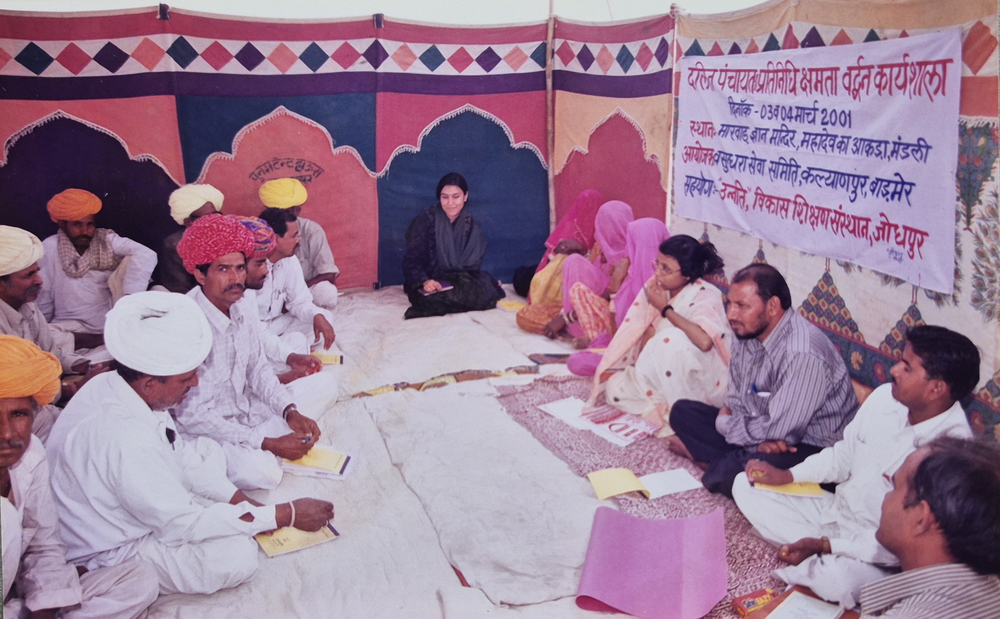
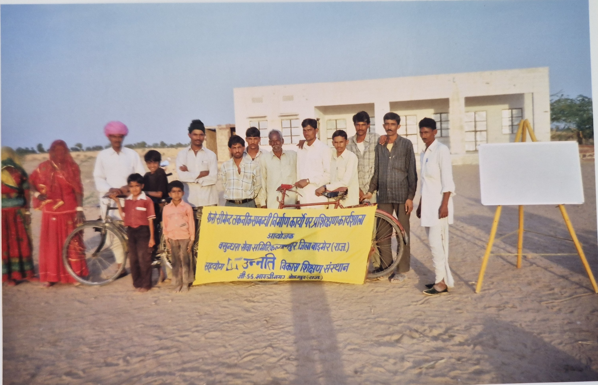
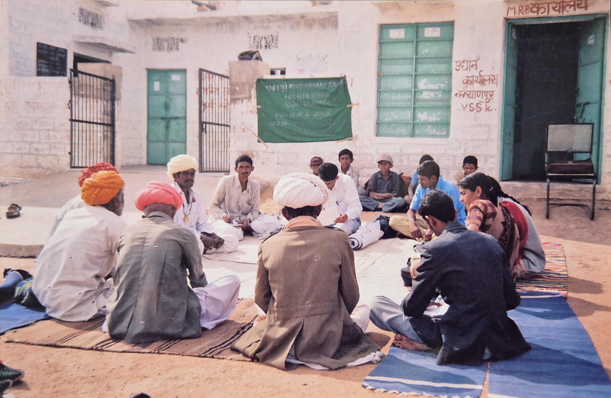

```{=html}
<div class="about-hero">
  <div class="about-hero-inner">
    <h2 class="about-hero-title">About Us</h2>
  </div>
</div>

<div class="focus-wrapper">
  <div class="about-container">
    <div class="about-intro-text reveal">
      <h3>Vasundhara Sewa Samiti</h3>
      <div class="focus-subtitle-wrapper">
        <p><strong>Vasundhara Sewa Samiti (VSS), Kalyanpur is a voluntary non-profit organization registered under the Rajasthan Societies Registration Act, 1958. The organization works in the remote desert region of western Rajasthan, particularly in Kalyanpur block of Balotra district, which was earlier part of the Barmer district located near the India–Pakistan border. The region lies in the Thar Desert belt, where communities face difficult environmental and socio-economic conditions.</strong></p>
        <p>This desert region is characterized by sandy terrain, extreme temperatures, irregular rainfall, frequent droughts, and water scarcity, which significantly affect the livelihoods of rural communities. People in these areas largely depend on rain-fed agriculture, livestock rearing, horticulture activities, and traditional water systems for their survival. Traditional water sources such as ponds, rainwater harvesting structures, talab, tanke, nadi, beri, and rural water tanks play an important role in meeting water needs in desert villages.</p>
        <p>Due to these challenges, rural households often experience poverty, seasonal migration, and limited access to education, healthcare, and basic infrastructure. These conditions particularly affect Scheduled Castes (SC), Scheduled Tribes (ST), women, landless families, persons with disabilities, and other marginalized groups living in remote villages.</p>
        <p>Established in 1996–97, Vasundhara Sewa Samiti works to strengthen rural communities through participatory and community-led development approaches. The organization focuses on community mobilization, awareness building, and promotion of fundamental rights, encouraging people to actively participate in development processes and access their entitlements. The organization also promotes community participation in Panchayati Raj Institutions, strengthening local governance and grassroots democracy.</p>
        <p>The organization focuses on key development areas such as rights-based community development, promotion of sustainable livelihoods, horticulture development, conservation of traditional water resources, health and environmental awareness, climate change adaptation, disaster response in drought-prone areas, and capacity building of rural communities.</p>
        <p>Vasundhara Sewa Samiti also promotes women’s empowerment and self-reliance by supporting livelihood activities such as making soap (saboon), detergent (surf), and other household products. In times of drought and scarcity, the organization has also supported rural families by distributing fodder (chaara) for livestock such as goats and camels, helping communities sustain their traditional livelihoods.</p>
        <p>Over the years, the organization has continued to empower rural communities in the Thar Desert region of Rajasthan, helping them build resilience, improve socio-economic conditions, protect natural resources, and participate actively in local governance and community development initiatives.</p>
      </div>
    </div>
  </div>

  <section class="about-gallery reveal" aria-label="About page image cards">
    <div class="about-gallery-grid">
      <article class="about-gallery-card">
        
        <div class="about-gallery-caption">
          <h4>Community Meetings</h4>
          <p>Listening first and planning with people on the ground.</p>
        </div>
      </article>
      <article class="about-gallery-card">
        
        <div class="about-gallery-caption">
          <h4>Field Action</h4>
          <p>Programs designed around practical local needs.</p>
        </div>
      </article>
      <article class="about-gallery-card">
        
        <div class="about-gallery-caption">
          <h4>Shared Progress</h4>
          <p>Building confidence, rights awareness, and community ownership.</p>
        </div>
      </article>
    </div>
  </section>

  <section class="reveal" style="max-width: 1200px; margin: 0 auto 56px; padding: 0 18px;">
    <div style="max-width: 640px;">
      <h3 style="color: #1a5c2a; font-weight: 700; margin-bottom: 20px;">Legal Status</h3>
      <div style="background: #fff; padding: 20px; border-left: 4px solid #1a5c2a; box-shadow: 0 2px 10px rgba(0,0,0,0.05);">
        <p style="margin-bottom: 10px;"><strong>Registration Act:</strong> Rajasthan State Cooperative Societies Act, 1958 (Section 28)</p>
        <p style="margin-bottom: 10px;"><strong>Registration Number:</strong> 13</p>
        <p style="margin-bottom: 0;"><strong>Registered Since:</strong> 12 June 1996–1997</p>
      </div>
    </div>
  </section>

  <div class="vss-theme-overview reveal" style="margin-top: 60px;">
    <h3 style="text-align: center; font-weight: 800; color: #2c3e50; margin-bottom: 40px; font-size: 2rem;">Our Principles</h3>
    <div class="about-principles-list">
      <div class="about-principles-item">
        <h4>Community Participation</h4>
        <p>Ensuring local leadership and active involvement in all stages of development.</p>
      </div>
      <div class="about-principles-item">
        <h4>Equity & Inclusion</h4>
        <p>Promoting non-discrimination and equal opportunities for all sections of society.</p>
      </div>
      <div class="about-principles-item">
        <h4>Rights-Based Approach</h4>
        <p>Focusing on rights and need-based planning to empower the marginalized.</p>
      </div>
      <div class="about-principles-item">
        <h4>Transparency</h4>
        <p>Maintaining accountability, partnership, and sustainability in all actions.</p>
      </div>
    </div>
  </div>

  <div class="vss-focus-band reveal" style="margin-top: 60px; padding-bottom: 60px;">
    <div class="vss-focus-band-inner">
      <h3 style="text-align: center; font-weight: 800; color: #2c3e50; margin-bottom: 40px; font-size: 2rem;">Our Objectives</h3>
      <div class="row">
        <div class="col-md-6 mb-3">
          <div class="d-flex align-items-start gap-3 p-3" style="background: #fff; border-radius: 8px; box-shadow: 0 2px 5px rgba(0,0,0,0.05); height: 100%;">
            <i class="bi bi-check-circle-fill" style="color: #1a5c2a; font-size: 1.5rem; margin-top: -5px;"></i>
            <p style="margin: 0; color: #555;">To work for the comprehensive development of economically, socially, and politically backward Dalit and vulnerable communities, without discrimination.</p>
          </div>
        </div>
        <div class="col-md-6 mb-3">
          <div class="d-flex align-items-start gap-3 p-3" style="background: #fff; border-radius: 8px; box-shadow: 0 2px 5px rgba(0,0,0,0.05); height: 100%;">
            <i class="bi bi-check-circle-fill" style="color: #1a5c2a; font-size: 1.5rem; margin-top: -5px;"></i>
            <p style="margin: 0; color: #555;">Promote public participation in development works, foster mutual trust and brotherhood, and empower leadership at the village level.</p>
          </div>
        </div>
        <div class="col-md-6 mb-3">
          <div class="d-flex align-items-start gap-3 p-3" style="background: #fff; border-radius: 8px; box-shadow: 0 2px 5px rgba(0,0,0,0.05); height: 100%;">
            <i class="bi bi-check-circle-fill" style="color: #1a5c2a; font-size: 1.5rem; margin-top: -5px;"></i>
            <p style="margin: 0; color: #555;">Providing assistance during natural and community-based disasters, and promoting cottage industries and folk arts.</p>
          </div>
        </div>
        <div class="col-md-6 mb-3">
          <div class="d-flex align-items-start gap-3 p-3" style="background: #fff; border-radius: 8px; box-shadow: 0 2px 5px rgba(0,0,0,0.05); height: 100%;">
            <i class="bi bi-check-circle-fill" style="color: #1a5c2a; font-size: 1.5rem; margin-top: -5px;"></i>
            <p style="margin: 0; color: #555;">Improving health, education, and environmental status for women, children, and elderly, and developing appropriate technology.</p>
          </div>
        </div>
        <div class="col-12 mb-3">
          <div class="d-flex align-items-start gap-3 p-3" style="background: #fff; border-radius: 8px; box-shadow: 0 2px 5px rgba(0,0,0,0.05);">
            <i class="bi bi-check-circle-fill" style="color: #1a5c2a; font-size: 1.5rem; margin-top: -5px;"></i>
            <p style="margin: 0; color: #555;">To eradicate social evils like superstitions, untouchability, child marriage, dowry, and build an equality-based society where individuals can make informed decisions.</p>
          </div>
        </div>
      </div>
    </div>
  </div>
</div>

<script>
  function reveal() {
    var reveals = document.querySelectorAll(".reveal");
    for (var i = 0; i < reveals.length; i++) {
      var windowHeight = window.innerHeight;
      var elementTop = reveals[i].getBoundingClientRect().top;
      var elementVisible = 150;
      if (elementTop < windowHeight - elementVisible) {
        reveals[i].classList.add("active");
      }
    }
  }
  window.addEventListener("scroll", reveal);
  // Trigger once on load
  reveal();
</script>
```
