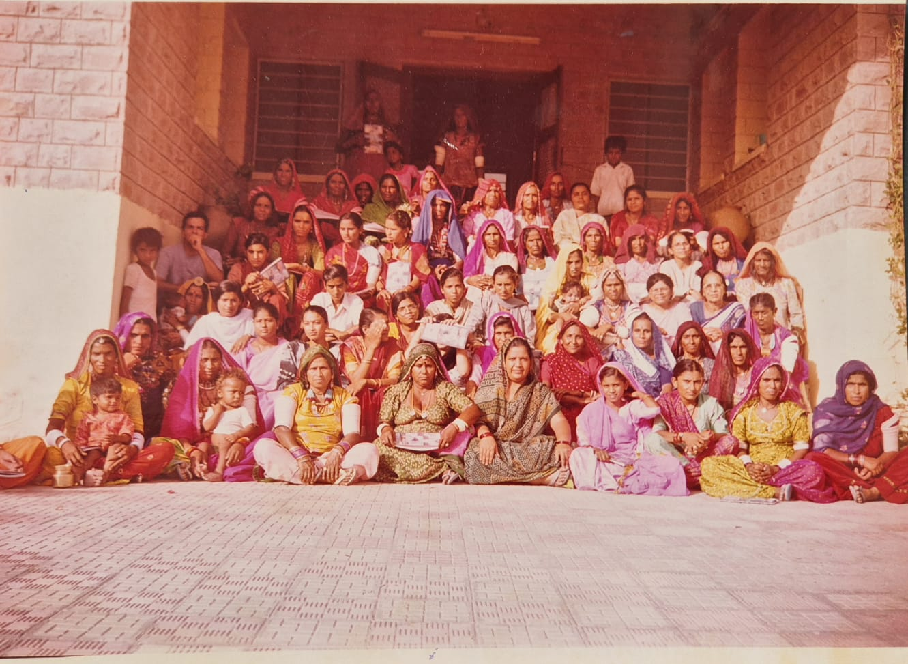

```{=html}
<div class="focus-hero">
  <div class="focus-hero-inner">
    <h2 class="focus-hero-title">Focus Areas</h2>
  </div>
</div>

<div class="focus-wrapper">
  <div class="focus-intro-container">
    <div class="focus-intro-text reveal">
      <h2>Focused Thematic Areas of Vasundhara Seva Samiti</h1>
      <div class="focus-subtitle-wrapper">
        <p>Four thematic areas guide our work to strengthen community systems and improve the lives of marginalized rural families.</p>
        <p>In western Rajasthan, Dalits and marginalized communities face a dual exclusion: they are physically distant from government services, and socially denied the rights that legally belong to them. Caste-based discrimination continues in schools and public spaces. Atrocities go unreported out of fear. Government benefits are captured by the powerful. The voice of the poor is rarely heard in administrative corridors.</p>
      </div>
    </div>
    <div class="focus-intro-image reveal">
      
    </div>
  </div>

  <div class="vss-theme-overview reveal" aria-label="Focus areas overview">
    <div class="vss-theme-overview-grid">
      <a class="vss-theme-overview-card" href="basicright.qmd">
        <div class="vss-theme-overview-icon"><i class="bi bi-shield-check" aria-hidden="true"></i></div>
        <h3>Fundamental Rights</h3>
        <p>Organizing communities to claim rights, dignity, justice, and accountability.</p>
      </a>

      <a class="vss-theme-overview-card" href="livelihood.qmd">
        <div class="vss-theme-overview-icon"><i class="bi bi-briefcase-fill" aria-hidden="true"></i></div>
        <h3>Livelihoods</h3>
        <p>Strengthening resilient incomes through skills, linkages, and local planning.</p>
      </a>

      <a class="vss-theme-overview-card" href="capacity.qmd">
        <div class="vss-theme-overview-icon"><i class="bi bi-mortarboard-fill" aria-hidden="true"></i></div>
        <h3>Capacity Building</h3>
        <p>Building knowledge and leadership so communities drive their own development.</p>
      </a>

      <a class="vss-theme-overview-card" href="disaster.qmd">
        <div class="vss-theme-overview-icon"><i class="bi bi-exclamation-triangle-fill" aria-hidden="true"></i></div>
        <h3>Disaster Management</h3>
        <p>Relief and preparedness to reduce drought impacts on vulnerable families.</p>
      </a>
    </div>
  </div>
</div>

<script>
  function reveal() {
    var reveals = document.querySelectorAll(".reveal");
    for (var i = 0; i < reveals.length; i++) {
      var windowHeight = window.innerHeight;
      var elementTop = reveals[i].getBoundingClientRect().top;
      var elementVisible = 150;
      if (elementTop < windowHeight - elementVisible) {
        reveals[i].classList.add("active");
      }
    }
  }
  window.addEventListener("scroll", reveal);
  // Trigger once on load
  reveal();
</script>
```
