```{=html}
<section class="vss-gallery-section">
  <div class="vss-gallery-header">
    <span class="vss-gallery-eyebrow">Visual Stories</span>
    <h2 class="vss-gallery-title">Covid-19 Mask Distribution in <em>Balotra</em>, Rajasthan</h2>
    <div class="vss-gallery-divider"></div>
    <p class="vss-gallery-subtitle">Snapshots from VSSK volunteers delivering masks, awareness and care across communities.</p>
  </div>

  <!-- Filter Tabs -->
  <div class="vss-filter-bar">
    <button class="vss-filter-btn active" data-filter="all">All Photos</button>
    <button class="vss-filter-btn" data-filter="distribution">Distribution</button>
    <button class="vss-filter-btn" data-filter="community">Community</button>
    <button class="vss-filter-btn" data-filter="volunteers">Volunteers</button>
    <button class="vss-filter-btn" data-filter="operations">Operations</button>
  </div>

  <!-- Photo Grid -->
  <div class="vss-grid" id="vssGalleryGrid">
    <div class="vss-grid-item vss-wide" data-category="distribution" data-index="0">
      <div class="vss-grid-img-wrap">
        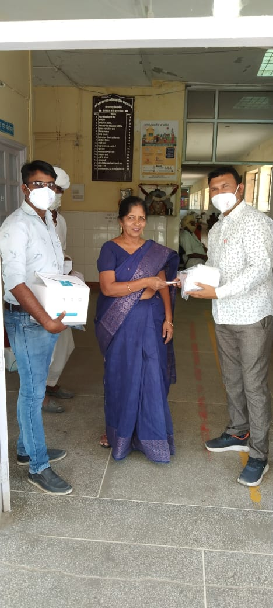
        <div class="vss-grid-overlay">
          <span class="vss-zoom-icon">
            <svg viewBox="0 0 24 24" fill="none" stroke="currentColor" stroke-width="2"><circle cx="11" cy="11" r="8"/><line x1="21" y1="21" x2="16.65" y2="16.65"/><line x1="11" y1="8" x2="11" y2="14"/><line x1="8" y1="11" x2="14" y2="11"/></svg>
          </span>
          <p class="vss-grid-caption">Masks Packed for Routes</p>
        </div>
      </div>
    </div>

    <div class="vss-grid-item" data-category="distribution" data-index="1">
      <div class="vss-grid-img-wrap">
        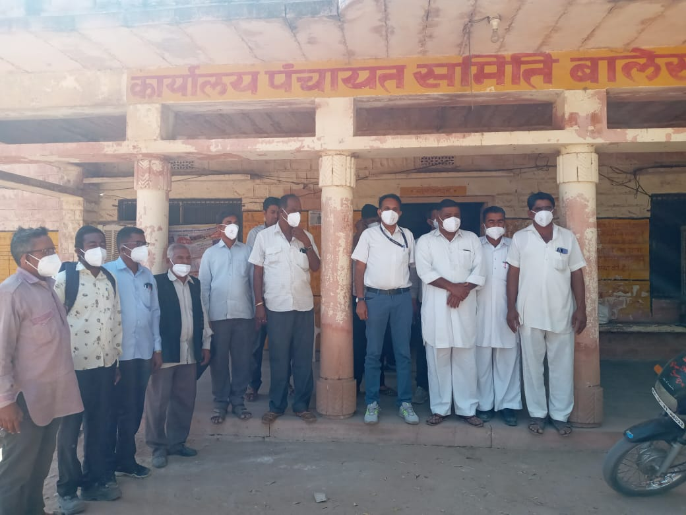
        <div class="vss-grid-overlay">
          <span class="vss-zoom-icon">
            <svg viewBox="0 0 24 24" fill="none" stroke="currentColor" stroke-width="2"><circle cx="11" cy="11" r="8"/><line x1="21" y1="21" x2="16.65" y2="16.65"/><line x1="11" y1="8" x2="11" y2="14"/><line x1="8" y1="11" x2="14" y2="11"/></svg>
          </span>
          <p class="vss-grid-caption">Door-to-Door Supply</p>
        </div>
      </div>
    </div>

    <div class="vss-grid-item" data-category="community" data-index="2">
      <div class="vss-grid-img-wrap">
        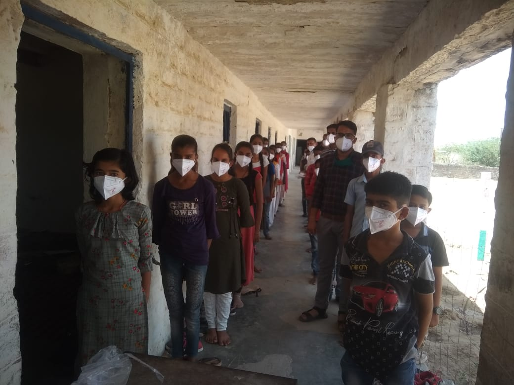
        <div class="vss-grid-overlay">
          <span class="vss-zoom-icon">
            <svg viewBox="0 0 24 24" fill="none" stroke="currentColor" stroke-width="2"><circle cx="11" cy="11" r="8"/><line x1="21" y1="21" x2="16.65" y2="16.65"/><line x1="11" y1="8" x2="11" y2="14"/><line x1="8" y1="11" x2="14" y2="11"/></svg>
          </span>
          <p class="vss-grid-caption">Family Receives Masks</p>
        </div>
      </div>
    </div>

    <div class="vss-grid-item vss-tall" data-category="volunteers" data-index="3">
      <div class="vss-grid-img-wrap">
        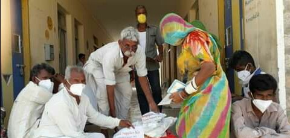
        <div class="vss-grid-overlay">
          <span class="vss-zoom-icon">
            <svg viewBox="0 0 24 24" fill="none" stroke="currentColor" stroke-width="2"><circle cx="11" cy="11" r="8"/><line x1="21" y1="21" x2="16.65" y2="16.65"/><line x1="11" y1="8" x2="11" y2="14"/><line x1="8" y1="11" x2="14" y2="11"/></svg>
          </span>
          <p class="vss-grid-caption">Women Volunteers</p>
        </div>
      </div>
    </div>

    <div class="vss-grid-item" data-category="volunteers" data-index="4">
      <div class="vss-grid-img-wrap">
        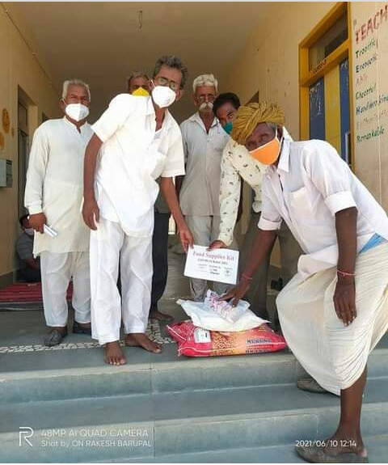
        <div class="vss-grid-overlay">
          <span class="vss-zoom-icon">
            <svg viewBox="0 0 24 24" fill="none" stroke="currentColor" stroke-width="2"><circle cx="11" cy="11" r="8"/><line x1="21" y1="21" x2="16.65" y2="16.65"/><line x1="11" y1="8" x2="11" y2="14"/><line x1="8" y1="11" x2="14" y2="11"/></svg>
          </span>
          <p class="vss-grid-caption">Youth Volunteers</p>
        </div>
      </div>
    </div>

    <div class="vss-grid-item" data-category="operations" data-index="5">
      <div class="vss-grid-img-wrap">
        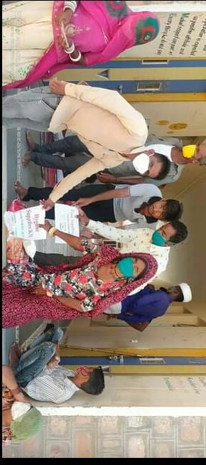
        <div class="vss-grid-overlay">
          <span class="vss-zoom-icon">
            <svg viewBox="0 0 24 24" fill="none" stroke="currentColor" stroke-width="2"><circle cx="11" cy="11" r="8"/><line x1="21" y1="21" x2="16.65" y2="16.65"/><line x1="11" y1="8" x2="11" y2="14"/><line x1="8" y1="11" x2="14" y2="11"/></svg>
          </span>
          <p class="vss-grid-caption">Safe Operations</p>
        </div>
      </div>
    </div>

    <div class="vss-grid-item" data-category="community" data-index="6">
      <div class="vss-grid-img-wrap">
        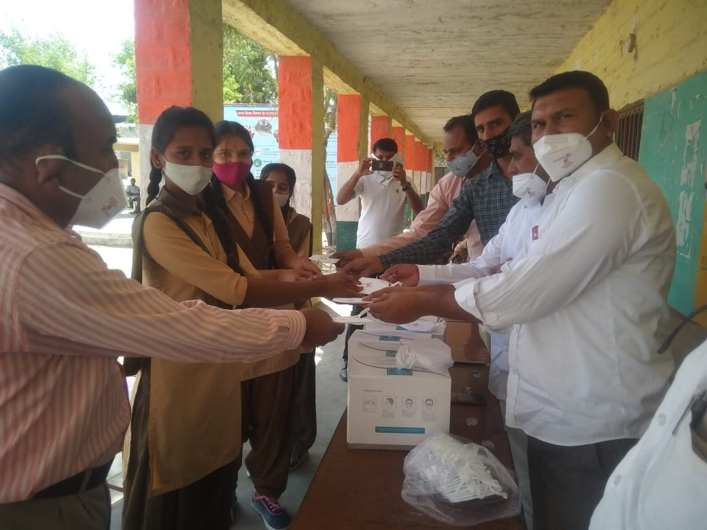
        <div class="vss-grid-overlay">
          <span class="vss-zoom-icon">
            <svg viewBox="0 0 24 24" fill="none" stroke="currentColor" stroke-width="2"><circle cx="11" cy="11" r="8"/><line x1="21" y1="21" x2="16.65" y2="16.65"/><line x1="11" y1="8" x2="11" y2="14"/><line x1="8" y1="11" x2="14" y2="11"/></svg>
          </span>
          <p class="vss-grid-caption">Senior Citizen Care</p>
        </div>
      </div>
    </div>

    <div class="vss-grid-item vss-wide" data-category="operations" data-index="7">
      <div class="vss-grid-img-wrap">
        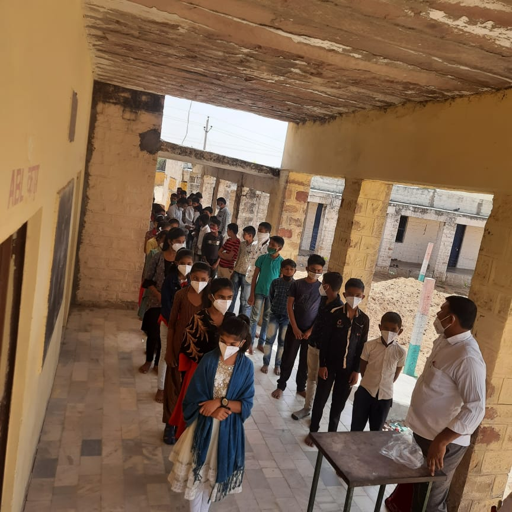
        <div class="vss-grid-overlay">
          <span class="vss-zoom-icon">
            <svg viewBox="0 0 24 24" fill="none" stroke="currentColor" stroke-width="2"><circle cx="11" cy="11" r="8"/><line x1="21" y1="21" x2="16.65" y2="16.65"/><line x1="11" y1="8" x2="11" y2="14"/><line x1="8" y1="11" x2="14" y2="11"/></svg>
          </span>
          <p class="vss-grid-caption">Logistics in Motion</p>
        </div>
      </div>
    </div>

    <div class="vss-grid-item" data-category="volunteers" data-index="8">
      <div class="vss-grid-img-wrap">
        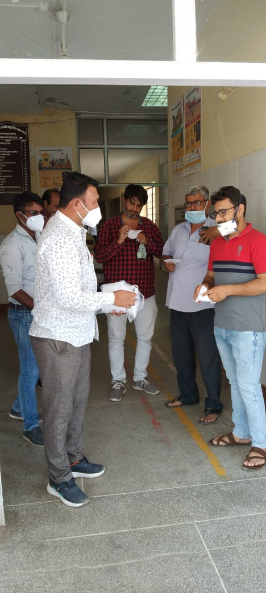
        <div class="vss-grid-overlay">
          <span class="vss-zoom-icon">
            <svg viewBox="0 0 24 24" fill="none" stroke="currentColor" stroke-width="2"><circle cx="11" cy="11" r="8"/><line x1="21" y1="21" x2="16.65" y2="16.65"/><line x1="11" y1="8" x2="11" y2="14"/><line x1="8" y1="11" x2="14" y2="11"/></svg>
          </span>
          <p class="vss-grid-caption">Mask Stitching</p>
        </div>
      </div>
    </div>

    <div class="vss-grid-item" data-category="distribution" data-index="9">
      <div class="vss-grid-img-wrap">
        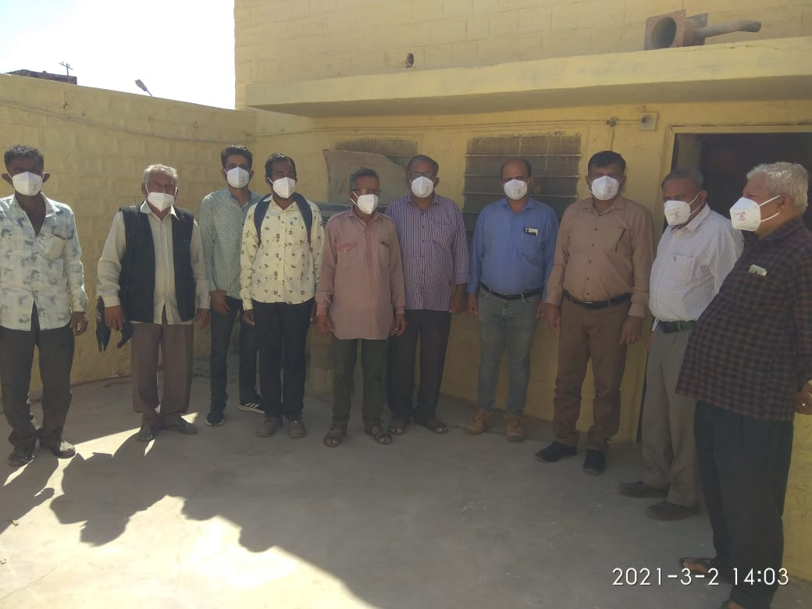
        <div class="vss-grid-overlay">
          <span class="vss-zoom-icon">
            <svg viewBox="0 0 24 24" fill="none" stroke="currentColor" stroke-width="2"><circle cx="11" cy="11" r="8"/><line x1="21" y1="21" x2="16.65" y2="16.65"/><line x1="11" y1="8" x2="11" y2="14"/><line x1="8" y1="11" x2="14" y2="11"/></svg>
          </span>
          <p class="vss-grid-caption">Distribution Line</p>
        </div>
      </div>
    </div>

    <div class="vss-grid-item" data-category="community" data-index="10">
      <div class="vss-grid-img-wrap">
        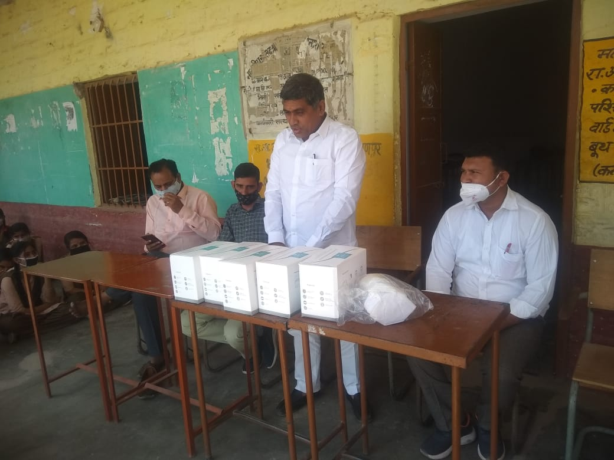
        <div class="vss-grid-overlay">
          <span class="vss-zoom-icon">
            <svg viewBox="0 0 24 24" fill="none" stroke="currentColor" stroke-width="2"><circle cx="11" cy="11" r="8"/><line x1="21" y1="21" x2="16.65" y2="16.65"/><line x1="11" y1="8" x2="11" y2="14"/><line x1="8" y1="11" x2="14" y2="11"/></svg>
          </span>
          <p class="vss-grid-caption">Mask Handover</p>
        </div>
      </div>
    </div>

    <div class="vss-grid-item" data-category="operations" data-index="11">
      <div class="vss-grid-img-wrap">
        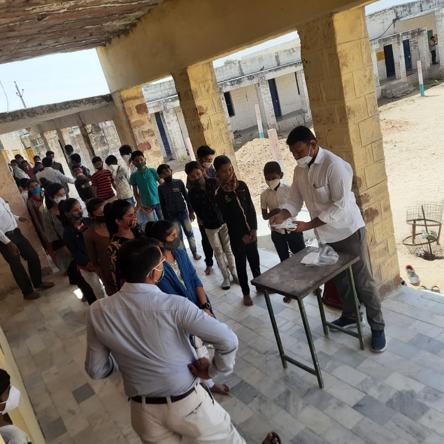
        <div class="vss-grid-overlay">
          <span class="vss-zoom-icon">
            <svg viewBox="0 0 24 24" fill="none" stroke="currentColor" stroke-width="2"><circle cx="11" cy="11" r="8"/><line x1="21" y1="21" x2="16.65" y2="16.65"/><line x1="11" y1="8" x2="11" y2="14"/><line x1="8" y1="11" x2="14" y2="11"/></svg>
          </span>
          <p class="vss-grid-caption">Health Worker Support</p>
        </div>
      </div>
    </div>

    <div class="vss-grid-item" data-category="community" data-index="12">
      <div class="vss-grid-img-wrap">
        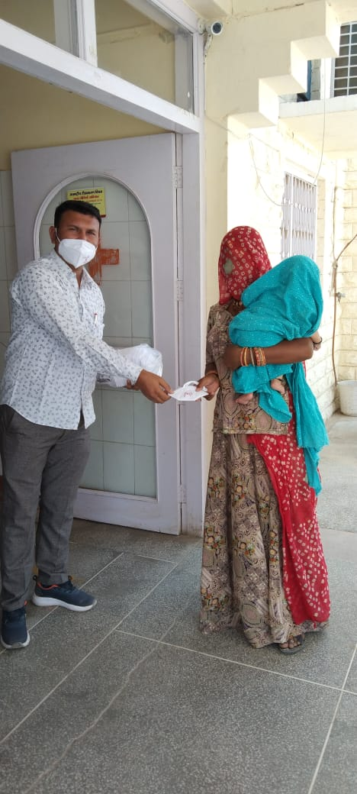
        <div class="vss-grid-overlay">
          <span class="vss-zoom-icon">
            <svg viewBox="0 0 24 24" fill="none" stroke="currentColor" stroke-width="2"><circle cx="11" cy="11" r="8"/><line x1="21" y1="21" x2="16.65" y2="16.65"/><line x1="11" y1="8" x2="11" y2="14"/><line x1="8" y1="11" x2="14" y2="11"/></svg>
          </span>
          <p class="vss-grid-caption">Awareness Session</p>
        </div>
      </div>
    </div>

    <div class="vss-grid-item" data-category="community" data-index="13">
      <div class="vss-grid-img-wrap">
        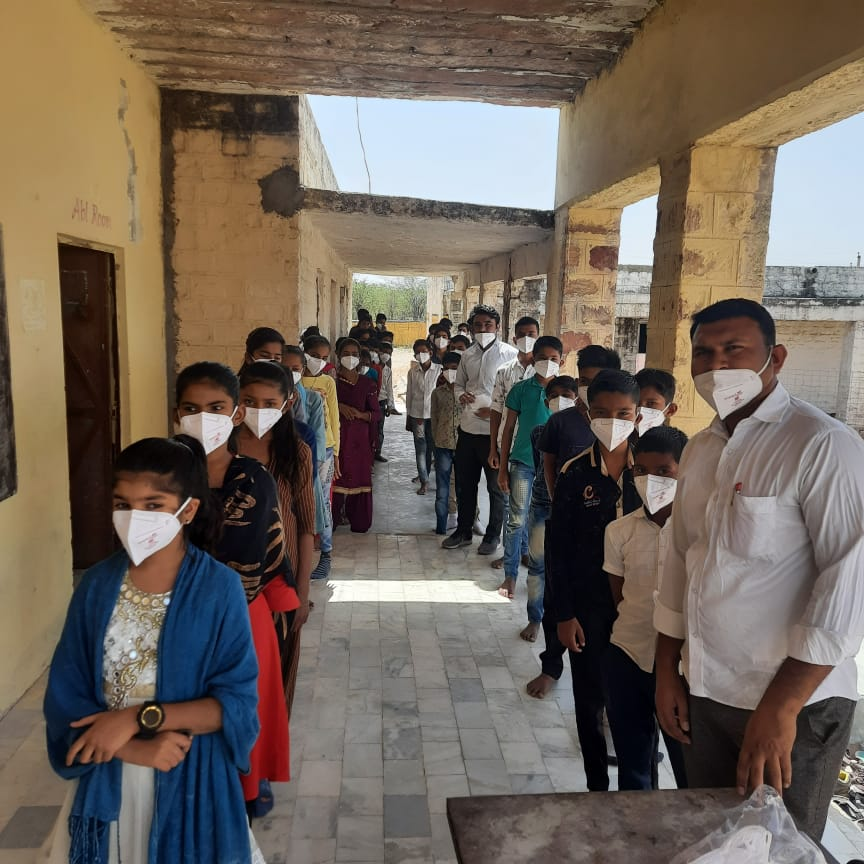
        <div class="vss-grid-overlay">
          <span class="vss-zoom-icon">
            <svg viewBox="0 0 24 24" fill="none" stroke="currentColor" stroke-width="2"><circle cx="11" cy="11" r="8"/><line x1="21" y1="21" x2="16.65" y2="16.65"/><line x1="11" y1="8" x2="11" y2="14"/><line x1="8" y1="11" x2="14" y2="11"/></svg>
          </span>
          <p class="vss-grid-caption">Village Meeting</p>
        </div>
      </div>
    </div>

    <div class="vss-grid-item" data-category="volunteers" data-index="14">
      <div class="vss-grid-img-wrap">
        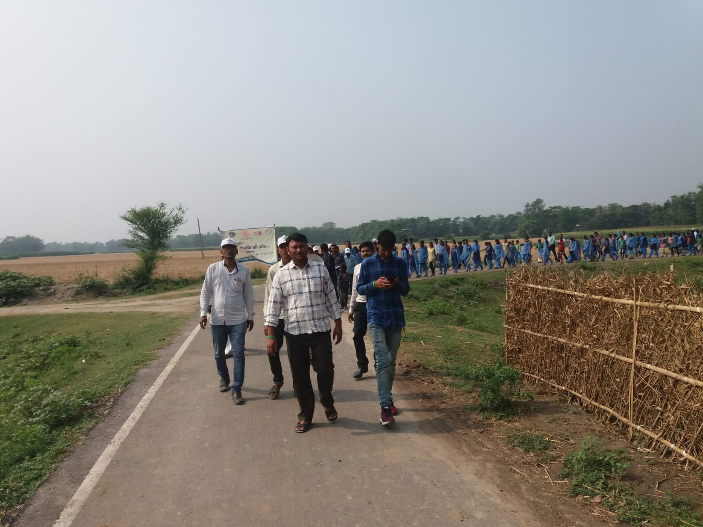
        <div class="vss-grid-overlay">
          <span class="vss-zoom-icon">
            <svg viewBox="0 0 24 24" fill="none" stroke="currentColor" stroke-width="2"><circle cx="11" cy="11" r="8"/><line x1="21" y1="21" x2="16.65" y2="16.65"/><line x1="11" y1="8" x2="11" y2="14"/><line x1="8" y1="11" x2="14" y2="11"/></svg>
          </span>
          <p class="vss-grid-caption">Volunteer Team</p>
        </div>
      </div>
    </div>
  </div><!-- /vss-grid -->

  <!-- Photo count -->
  <div class="vss-photo-count">
    <span id="vssVisibleCount">15</span> photos from the drive
  </div>
</section>

<!-- LIGHTBOX OVERLAY -->
<div class="vss-lightbox" id="vssLightbox" role="dialog" aria-modal="true">
  <div class="vss-lb-backdrop" id="vssLbBackdrop"></div>

  <button class="vss-lb-close" id="vssLbClose" aria-label="Close">
    <svg viewBox="0 0 24 24" fill="none" stroke="currentColor" stroke-width="2"><line x1="18" y1="6" x2="6" y2="18"/><line x1="6" y1="6" x2="18" y2="18"/></svg>
  </button>

  <button class="vss-lb-ctrl vss-lb-prev" id="vssLbPrev" aria-label="Previous photo">
    <svg viewBox="0 0 24 24" fill="none" stroke="currentColor" stroke-width="2"><polyline points="15 18 9 12 15 6"/></svg>
  </button>

  <div class="vss-lb-stage">
    <div class="vss-lb-img-wrap">
      
    </div>
    <div class="vss-lb-info">
      <p class="vss-lb-caption" id="vssLbCaption"></p>
      <span class="vss-lb-counter"><span id="vssLbCur">1</span> / <span id="vssLbTotal">15</span></span>
    </div>
  </div>

  <button class="vss-lb-ctrl vss-lb-next" id="vssLbNext" aria-label="Next photo">
    <svg viewBox="0 0 24 24" fill="none" stroke="currentColor" stroke-width="2"><polyline points="9 18 15 12 9 6"/></svg>
  </button>

  <!-- thumbnail strip -->
  <div class="vss-lb-thumbs" id="vssLbThumbs"></div>
</div>


<!-- STYLES -->
<style>
:root {
  --g-green:  #1a5c2a;
  --g-gold:   #c8973a;
  --g-gold-l: #e9c46a;
  --g-dark:   #0d1a10;
  --g-white:  #fdfcf8;
  --g-font-d: 'Cormorant Garamond', Georgia, serif;
  --g-font-b: 'Nunito Sans', system-ui, sans-serif;
}

.vss-gallery-section {
  padding: 72px 0 64px;
  background: radial-gradient(circle at 20% 20%, #f6fbf7 0, #f3f8f3 30%, #eef3ee 65%, #e8eee8 100%);
  font-family: var(--g-font-b);
}

.vss-gallery-header {
  text-align: center;
  max-width: 840px;
  margin: 0 auto 2.8rem;
  padding: 0 24px;
}
.vss-gallery-eyebrow {
  display: inline-block;
  font-size: 0.7rem;
  font-weight: 800;
  letter-spacing: 0.22em;
  text-transform: uppercase;
  color: var(--g-green);
  border-bottom: 2px solid var(--g-gold);
  padding-bottom: 3px;
  margin-bottom: 1rem;
}
.vss-gallery-title {
  font-family: var(--g-font-d);
  font-size: clamp(1.9rem, 4vw, 3rem);
  font-weight: 700;
  color: #1a2a1e;
  line-height: 1.12;
  margin: 0 0 1rem;
}
.vss-gallery-title em { color: var(--g-green); font-style: italic; }
.vss-gallery-divider {
  width: 64px; height: 3px;
  background: linear-gradient(90deg, var(--g-green), var(--g-gold));
  margin: 0 auto 1.3rem;
  border-radius: 2px;
}
.vss-gallery-subtitle {
  font-size: 1rem;
  color: #536657;
  line-height: 1.65;
  font-weight: 300;
  margin: 0;
}

.vss-filter-bar {
  display: flex;
  justify-content: center;
  gap: 0.55rem;
  flex-wrap: wrap;
  margin-bottom: 2.5rem;
  padding: 0 24px;
}
.vss-filter-btn {
  font-size: 0.78rem;
  font-weight: 800;
  letter-spacing: 0.1em;
  text-transform: uppercase;
  padding: 0.45rem 1.2rem;
  border-radius: 999px;
  border: 1.5px solid #c8d8cb;
  background: rgba(255,255,255,0.8);
  color: #536657;
  cursor: pointer;
  transition: all 0.22s ease, box-shadow 0.22s ease;
  box-shadow: 0 4px 12px rgba(0,0,0,0.05);
}
.vss-filter-btn:hover {
  border-color: var(--g-green);
  color: var(--g-green);
  box-shadow: 0 10px 24px rgba(26,92,42,0.16);
}
.vss-filter-btn.active {
  background: linear-gradient(120deg, var(--g-green), #2a7a3d);
  border-color: var(--g-green);
  color: #fff;
  box-shadow: 0 12px 26px rgba(26,92,42,0.22);
}

.vss-grid {
  display: grid;
  grid-template-columns: repeat(4, 1fr);
  grid-auto-rows: 240px;
  gap: 8px;
  padding: 0 12px;
  max-width: 1400px;
  margin: 0 auto;
}
.vss-grid-item { position: relative; overflow: hidden; cursor: pointer; opacity: 0; transform: translateY(24px) scale(0.96) rotate(-0.4deg); filter: saturate(0.92); transition: opacity 0.55s ease, transform 0.55s cubic-bezier(0.16,1,0.3,1), filter 0.35s ease; }
.vss-grid-item.is-visible { opacity: 1; transform: translateY(0) scale(1) rotate(0deg); filter: saturate(1.05); }
.vss-grid-item.vss-wide { grid-column: span 2; }
.vss-grid-item.vss-tall { grid-row: span 2; }
.vss-grid-item.hidden { display: none; }

.vss-grid-img-wrap { position: relative; width: 100%; height: 100%; overflow: hidden; border-radius: 6px; }
.vss-grid-img-wrap img { width: 100%; height: 100%; object-fit: cover; transition: transform 0.6s cubic-bezier(0.4,0,0.2,1), filter 0.4s ease; filter: brightness(0.95) saturate(0.98); }
.vss-grid-item:hover .vss-grid-img-wrap img { transform: scale(1.08); filter: brightness(0.7) saturate(1.1); }

.vss-grid-overlay {
  position: absolute;
  inset: 0;
  display: flex;
  flex-direction: column;
  align-items: center;
  justify-content: center;
  gap: 0.55rem;
  opacity: 0;
  background: radial-gradient(circle at 50% 45%, rgba(26,92,42,0.0), rgba(13,26,16,0.65));
  transition: opacity 0.38s ease, background 0.38s ease;
  padding: 1rem;
}
.vss-grid-item:hover .vss-grid-overlay { opacity: 1; background: radial-gradient(circle at 50% 40%, rgba(26,92,42,0.15), rgba(13,26,16,0.72)); }

.vss-zoom-icon { width: 48px; height: 48px; border-radius: 50%; border: 2px solid rgba(255,255,255,0.85); display: grid; place-items: center; color: #fff; transform: scale(0.7); transition: transform 0.3s ease, box-shadow 0.3s ease; box-shadow: 0 12px 30px rgba(0,0,0,0.25); }
.vss-grid-item:hover .vss-zoom-icon { transform: scale(1); box-shadow: 0 14px 32px rgba(26,92,42,0.35); }
.vss-zoom-icon svg { width: 22px; height: 22px; }

.vss-grid-caption { font-size: 0.78rem; font-weight: 800; letter-spacing: 0.12em; text-transform: uppercase; color: rgba(255,255,255,0.92); margin: 0; text-align: center; }

.vss-photo-count { text-align: center; margin-top: 1.8rem; font-size: 0.84rem; font-weight: 700; letter-spacing: 0.08em; text-transform: uppercase; color: #7c907f; }
#vssVisibleCount { color: var(--g-green); font-size: 1rem; }

/* LIGHTBOX */
.vss-lightbox { position: fixed; inset: 0; z-index: 9999; display: flex; align-items: center; justify-content: center; opacity: 0; pointer-events: none; transition: opacity 0.28s ease; }
.vss-lightbox.open { opacity: 1; pointer-events: auto; }
.vss-lb-backdrop { position: absolute; inset: 0; background: rgba(8, 18, 10, 0.96); backdrop-filter: blur(6px); }

.vss-lb-close { position: absolute; top: 1.2rem; right: 1.4rem; z-index: 10; width: 44px; height: 44px; border-radius: 50%; border: 1.5px solid rgba(255,255,255,0.25); background: transparent; color: rgba(255,255,255,0.7); cursor: pointer; display: grid; place-items: center; transition: background 0.2s, color 0.2s; }
.vss-lb-close:hover { background: rgba(255,255,255,0.12); color: #fff; }
.vss-lb-close svg { width: 20px; height: 20px; }

.vss-lb-ctrl { position: relative; z-index: 10; width: 52px; height: 52px; border-radius: 50%; border: 1.5px solid rgba(255,255,255,0.2); background: rgba(255,255,255,0.06); color: rgba(255,255,255,0.8); cursor: pointer; display: grid; place-items: center; flex-shrink: 0; transition: background 0.22s, border-color 0.22s, transform 0.22s; }
.vss-lb-ctrl:hover { background: var(--g-green); border-color: var(--g-green); color: #fff; transform: scale(1.08); }
.vss-lb-ctrl svg { width: 24px; height: 24px; }

.vss-lb-stage { position: relative; z-index: 10; display: flex; flex-direction: column; align-items: center; flex: 1; max-width: 940px; padding: 0 1rem; }
.vss-lb-img-wrap { width: 100%; max-height: 72vh; display: flex; align-items: center; justify-content: center; overflow: hidden; }
.vss-lb-img-wrap img { max-width: 100%; max-height: 72vh; object-fit: contain; border-radius: 4px; box-shadow: 0 20px 60px rgba(0,0,0,0.6); transition: opacity 0.22s ease, transform 0.32s ease; }
.vss-lb-img-wrap img.fade { opacity: 0; transform: scale(0.96); }

.vss-lb-info { display: flex; align-items: center; justify-content: space-between; width: 100%; margin-top: 1rem; padding: 0 0.5rem; }
.vss-lb-caption { font-family: var(--g-font-d); font-size: 1.1rem; font-weight: 600; color: rgba(255,255,255,0.85); margin: 0; }
.vss-lb-counter { font-size: 0.78rem; letter-spacing: 0.12em; color: rgba(255,255,255,0.4); white-space: nowrap; }
#vssLbCur { color: var(--g-gold-l, #e9c46a); font-size: 1rem; font-weight: 600; }

.vss-lb-thumbs { position: absolute; bottom: 1.2rem; left: 50%; transform: translateX(-50%); z-index: 10; display: flex; gap: 6px; max-width: 90vw; overflow-x: auto; padding: 4px 8px; scrollbar-width: none; }
.vss-lb-thumbs::-webkit-scrollbar { display: none; }
.vss-lb-thumb { width: 52px; height: 38px; border-radius: 3px; overflow: hidden; cursor: pointer; opacity: 0.4; border: 2px solid transparent; transition: opacity 0.2s, border-color 0.2s; flex-shrink: 0; }
.vss-lb-thumb img { width: 100%; height: 100%; object-fit: cover; }
.vss-lb-thumb.active { opacity: 1; border-color: var(--g-gold); }

@media (max-width: 900px) {
  .vss-grid { grid-template-columns: repeat(2,1fr); grid-auto-rows: 200px; }
  .vss-grid-item.vss-wide { grid-column: span 2; }
  .vss-lb-ctrl { display: none; }
}
@media (max-width: 480px) {
  .vss-grid { grid-template-columns: repeat(2,1fr); grid-auto-rows: 160px; gap: 6px; }
}
</style>


<!-- JAVASCRIPT -->
<script>
(function () {
  const items   = Array.from(document.querySelectorAll('.vss-grid-item'));
  const lbEl    = document.getElementById('vssLightbox');
  const lbImg   = document.getElementById('vssLbImg');
  const lbCap   = document.getElementById('vssLbCaption');
  const lbCur   = document.getElementById('vssLbCur');
  const lbTotal = document.getElementById('vssLbTotal');
  const lbThumbs= document.getElementById('vssLbThumbs');
  const countEl = document.getElementById('vssVisibleCount');

  let visibleItems = items.slice();
  let current = 0;

  function buildThumbs() {
    lbThumbs.innerHTML = '';
    visibleItems.forEach((item, i) => {
      const src = item.querySelector('img').src;
      const t   = document.createElement('div');
      t.className = 'vss-lb-thumb' + (i === current ? ' active' : '');
      t.innerHTML = ``;
      t.addEventListener('click', () => goTo(i));
      lbThumbs.appendChild(t);
    });
    lbTotal.textContent = visibleItems.length;
  }

  function openLightbox(index) {
    current = index;
    lbEl.classList.add('open');
    document.body.style.overflow = 'hidden';
    buildThumbs();
    showImage(current, false);
  }

  function closeLightbox() {
    lbEl.classList.remove('open');
    document.body.style.overflow = '';
  }

  function showImage(index, animate = true) {
    const item = visibleItems[index];
    const img  = item.querySelector('img');
    const cap  = item.querySelector('.vss-grid-caption');

    if (animate) {
      lbImg.classList.add('fade');
      setTimeout(() => {
        lbImg.src = img.src;
        lbImg.alt = img.alt;
        lbCap.textContent = cap ? cap.textContent : '';
        lbCur.textContent = index + 1;
        lbImg.classList.remove('fade');
      }, 200);
    } else {
      lbImg.src = img.src;
      lbImg.alt = img.alt;
      lbCap.textContent = cap ? cap.textContent : '';
      lbCur.textContent = index + 1;
    }

    document.querySelectorAll('.vss-lb-thumb').forEach((t, i) => {
      t.classList.toggle('active', i === index);
    });

    const activeThumb = lbThumbs.children[index];
    if (activeThumb) activeThumb.scrollIntoView({ inline: 'center', behavior: 'smooth' });
  }

  function goTo(n) {
    current = ((n % visibleItems.length) + visibleItems.length) % visibleItems.length;
    showImage(current);
  }

  items.forEach((item) => {
    item.addEventListener('click', () => {
      const idx = visibleItems.indexOf(item);
      if (idx !== -1) openLightbox(idx);
    });
  });

  document.getElementById('vssLbClose').addEventListener('click', closeLightbox);
  document.getElementById('vssLbBackdrop').addEventListener('click', closeLightbox);
  document.getElementById('vssLbPrev').addEventListener('click', () => goTo(current - 1));
  document.getElementById('vssLbNext').addEventListener('click', () => goTo(current + 1));

  document.addEventListener('keydown', e => {
    if (!lbEl.classList.contains('open')) return;
    if (e.key === 'ArrowRight') goTo(current + 1);
    if (e.key === 'ArrowLeft')  goTo(current - 1);
    if (e.key === 'Escape')     closeLightbox();
  });

  let touchX = 0;
  lbEl.addEventListener('touchstart', e => { touchX = e.touches[0].clientX; }, { passive: true });
  lbEl.addEventListener('touchend',   e => {
    const diff = touchX - e.changedTouches[0].clientX;
    if (Math.abs(diff) > 40) goTo(diff > 0 ? current + 1 : current - 1);
  }, { passive: true });

  document.querySelectorAll('.vss-filter-btn').forEach(btn => {
    btn.addEventListener('click', () => {
      document.querySelectorAll('.vss-filter-btn').forEach(b => b.classList.remove('active'));
      btn.classList.add('active');

      const filter = btn.dataset.filter;
      items.forEach(item => {
        const match = filter === 'all' || item.dataset.category === filter;
        item.classList.toggle('hidden', !match);
      });

      visibleItems = items.filter(i => !i.classList.contains('hidden'));
      countEl.textContent = visibleItems.length;
    });
  });

  const revealObserver = new IntersectionObserver((entries) => {
    entries.forEach((entry) => {
      if (entry.isIntersecting) {
        const i = items.indexOf(entry.target);
        entry.target.style.transitionDelay = `${(i % 4) * 60}ms`;
        entry.target.classList.add('is-visible');
        revealObserver.unobserve(entry.target);
      }
    });
  }, { threshold: 0.16 });

  items.forEach(item => { revealObserver.observe(item); });
})();
</script>
```
