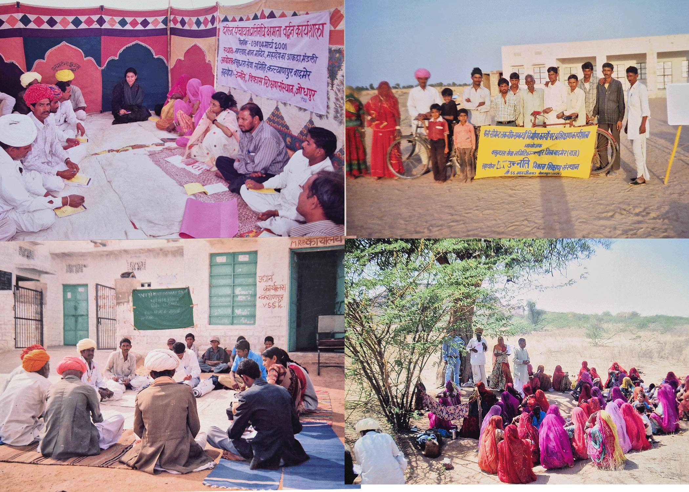

```{=html}

<div id="vssCarousel" class="carousel slide carousel-fade" data-bs-ride="carousel" data-bs-interval="4500" data-bs-pause="false">
  <div class="carousel-indicators">
    <button type="button" data-bs-target="#vssCarousel" data-bs-slide-to="0" class="active"></button>
    <button type="button" data-bs-target="#vssCarousel" data-bs-slide-to="1"></button>
    <button type="button" data-bs-target="#vssCarousel" data-bs-slide-to="2"></button>
    <button type="button" data-bs-target="#vssCarousel" data-bs-slide-to="3"></button>
    <button type="button" data-bs-target="#vssCarousel" data-bs-slide-to="4"></button>
    <button type="button" data-bs-target="#vssCarousel" data-bs-slide-to="5"></button>
  </div>
  <div class="carousel-inner">
    <div class="carousel-item active">
      
      <div class="carousel-caption d-none d-md-block">
        <h2>Rights-Based Work</h2>
        <p>Strengthening marginalized communities to claim their legal rights, challenge caste-based discrimination, and access justice and government entitlements through collective action and advocacy.</p>
      </div>
    </div>
    <div class="carousel-item">
      
      <div class="carousel-caption d-none d-md-block">
        <h2>Livelihood</h2>
        <p>Strengthening sustainable livelihoods of marginalized communities through improved agriculture, livestock support, and better access to land, markets, and government welfare programs.</p>
      </div>
    </div>
    <div class="carousel-item">
      
      <div class="carousel-caption d-none d-md-block">
        <h2>Disaster Management</h2>
        <p>Building community resilience to drought and crises through preparedness, risk reduction, and timely support for the most vulnerable communities.</p>
      </div>
    </div>
    <div class="carousel-item">
      
      <div class="carousel-caption d-none d-md-block">
        <h2>Capacity Building</h2>
        <p>Enhancing the skills, awareness, and leadership capacities of community members and grassroots groups to promote self-reliance and effective participation in development processes.</p>
      </div>
    </div>
    <div class="carousel-item">
      
    </div>
    <div class="carousel-item">
      
    </div>
  </div>
  <button class="carousel-control-prev" type="button" data-bs-target="#vssCarousel" data-bs-slide="prev">
    <span class="carousel-control-prev-icon"></span>
  </button>
  <button class="carousel-control-next" type="button" data-bs-target="#vssCarousel" data-bs-slide="next">
    <span class="carousel-control-next-icon"></span>
  </button>
</div>

<div class="about-home">
  <h2 class="section-title">Vasundhara Sewa Samiti</h2>
  <div class="section-divider"></div>
  
  <p>Vasundhara Sewa Samiti is a non-governmental, non-profit organization registered under the Rajasthan State Cooperative/Societies Act, 1958. The organization works in the rural and drought-prone regions of Balotra district, Rajasthan, focusing on the development and empowerment of marginalized communities.</p>
  
  <p>Our mission is to strengthen the capacities of women, youth, children, scheduled castes, and economically weaker sections so that they can access their rights, resources, and opportunities for a dignified life. We believe that sustainable development is possible when communities themselves actively participate in decision-making and development processes.</p>
  
  <p>The organization implements community-based development initiatives in the areas of sustainable livelihoods, education, water conservation and water resource management, disaster risk reduction, institutional development, environmental awareness, and access to government welfare schemes. Through participatory and rights-based approaches, we work closely with local communities, government institutions, and civil society partners to ensure inclusive and sustainable development.</p>
  
  <p><span class="org-name-highlight">Vasundhara Sewa Samiti</span> is committed to improving the quality of life of rural communities by promoting sustainable livelihoods, water security, social justice, and community empowerment. By combining traditional community knowledge with practical development strategies, the organization contributes towards long-term rural development and aligns its work with national priorities and the Sustainable Development Goals (SDGs).</p>
  
  <div class="about-home-actions">
    <a href="about.html" class="btn-vss">Read More About Us</a>
    <a href="contact.html" class="btn-vss-outline">Contact Us</a>
  </div>
</div>

<div class="focused-areas-section">
  <h2 class="section-title">Focused Thematic Areas of Vasundhara Sewa Samiti</h2>
  <div class="section-divider"></div>
  
  <div class="container-fluid px-4 mt-5">
    <div class="row g-4 align-items-center text-center">
      <div class="col-12">
        <div class="focused-area-card p-0">
          <div class="circle-img-wrapper mx-auto mb-2">
            
          </div>
          <h4 class="area-title mb-2">Right Based</h4>
          <p class="area-desc text-center mx-auto" style="max-width: 800px; font-size: 1.1rem; line-height: 1.6;">In western Rajasthan, Dalits and marginalized communities face a dual exclusion: they are physically distant from government services, and socially denied the rights that legally belong to them. Caste-based discrimination continues in schools and public spaces.</p>
        </div>
      </div>
      
      <div class="col-12">
        <div class="focused-area-card p-0">
          <div class="circle-img-wrapper mx-auto mb-2">
            
          </div>
          <h4 class="area-title mb-2">Livelihood</h4>
          <p class="area-desc text-center mx-auto" style="max-width: 800px; font-size: 1.1rem; line-height: 1.6;">Promoting sustainable livelihoods through skills training, local planning, and connecting families with support schemes. We focus on agriculture, animal husbandry, and vocational training to ensure economic stability for rural households.</p>
        </div>
      </div>
      
      <div class="col-12">
        <div class="focused-area-card p-0">
          <div class="circle-img-wrapper mx-auto mb-2">
            
          </div>
          <h4 class="area-title mb-2">Disaster Management</h4>
          <p class="area-desc text-center mx-auto" style="max-width: 800px; font-size: 1.1rem; line-height: 1.6;">Building preparedness and community response capacity to reduce disaster risk and protect vulnerable families. We work on drought mitigation, water conservation, and emergency relief distribution during crises.</p>
        </div>
      </div>

      <div class="col-12">
        <div class="focused-area-card p-0">
          <div class="circle-img-wrapper mx-auto mb-2">
            
          </div>
          <h4 class="area-title mb-2">Capacity Building</h4>
          <p class="area-desc text-center mx-auto" style="max-width: 800px; font-size: 1.1rem; line-height: 1.6;">Strengthening institutions, community leaders, and grassroots workers through training and mentoring. We empower local governance structures and community-based organizations to function effectively and democratically.</p>
        </div>
      </div>
    </div>
  </div>
</div>

<style>
  @import url('https://fonts.googleapis.com/css2?family=Lora:wght@400;600;700&family=Source+Sans+3:wght@400;500;600&display=swap');

  .impact-story-section,
  .impact-story-section * {
    box-sizing: border-box;
  }

  .impact-story-section {
    font-family: "Source Sans 3", sans-serif;
    background: #e8f2e8;
    padding: 60px 20px 70px;
    position: relative;
    overflow: hidden;
    margin-top: 30px;
  }

  .impact-story-section::after {
    content: "";
    position: absolute;
    bottom: 0;
    left: 0;
    right: 0;
    height: 60px;
    background: url("data:image/svg+xml,%3Csvg xmlns='http://www.w3.org/2000/svg' viewBox='0 0 1440 60'%3E%3Cpath fill='%23f2f7f2' d='M0,30 C200,60 400,0 720,30 C1040,60 1240,0 1440,30 L1440,60 L0,60 Z'/%3E%3C/svg%3E") no-repeat bottom center / cover;
  }

  .impact-story-heading {
    text-align: center;
    margin-bottom: 36px;
  }

  .impact-story-heading h2 {
    font-family: "Lora", serif;
    font-size: clamp(1.6rem, 3vw, 2.2rem);
    font-weight: 600;
    color: #2d5a2d;
    margin-bottom: 14px;
  }

  .impact-story-divider {
    display: flex;
    align-items: center;
    justify-content: center;
    gap: 12px;
  }

  .impact-story-divider-line {
    width: 70px;
    height: 2px;
    background: #8b1a1a;
    border-radius: 2px;
  }

  .impact-story-divider-icon {
    font-size: 1.3rem;
    color: #3a7a3a;
  }

  .impact-story-carousel {
    max-width: 1100px;
    margin: 0 auto;
    position: relative;
  }

  .impact-story-track-wrap {
    overflow: hidden;
    border-radius: 4px;
  }

  .impact-story-track {
    display: flex;
    gap: 24px;
    transition: transform 0.55s cubic-bezier(0.25, 0.46, 0.45, 0.94);
    will-change: transform;
  }

  .impact-story-card {
    flex: 0 0 calc((100% - 48px) / 3);
    background: #fff;
    border-radius: 6px;
    overflow: hidden;
    box-shadow: 0 2px 12px rgba(0, 0, 0, 0.08);
    transition: transform 0.3s ease, box-shadow 0.3s ease;
    animation: impactStoryFadeUp 0.6s ease both;
  }

  .impact-story-card:nth-child(1) { animation-delay: 0.05s; }
  .impact-story-card:nth-child(2) { animation-delay: 0.15s; }
  .impact-story-card:nth-child(3) { animation-delay: 0.25s; }
  .impact-story-card:nth-child(4) { animation-delay: 0.05s; }
  .impact-story-card:nth-child(5) { animation-delay: 0.15s; }

  .impact-story-card:hover {
    transform: translateY(-5px);
    box-shadow: 0 8px 28px rgba(0, 0, 0, 0.13);
  }

  .impact-story-card.impact-in-view {
    animation: impactStoryFadeUp 0.55s ease both;
  }

  .impact-story-card img {
    width: 100%;
    height: 200px;
    object-fit: cover;
    display: block;
    background: #c8dfc8;
  }

  .impact-story-body {
    padding: 20px 20px 24px;
  }

  .impact-story-body h3 {
    font-family: "Lora", serif;
    font-size: 1.05rem;
    font-weight: 700;
    color: #2d5a2d;
    line-height: 1.4;
    margin-bottom: 10px;
  }

  .impact-story-body p {
    font-size: 0.88rem;
    color: #555;
    line-height: 1.65;
    margin-bottom: 0;
  }

  .impact-story-dots {
    display: flex;
    justify-content: center;
    gap: 8px;
    margin-top: 28px;
  }

  .impact-story-dot {
    width: 9px;
    height: 9px;
    border-radius: 50%;
    background: #b0c9b0;
    border: none;
    cursor: pointer;
    padding: 0;
    transition: background 0.25s, transform 0.25s;
  }

  .impact-story-dot.active {
    background: #3a7a3a;
    transform: scale(1.25);
  }

  .impact-story-arrow {
    position: absolute;
    top: 50%;
    transform: translateY(-50%);
    background: #fff;
    border: none;
    border-radius: 50%;
    width: 38px;
    height: 38px;
    box-shadow: 0 2px 10px rgba(0, 0, 0, 0.12);
    cursor: pointer;
    font-size: 1rem;
    color: #3a7a3a;
    display: flex;
    align-items: center;
    justify-content: center;
    z-index: 10;
    transition: background 0.2s, transform 0.2s;
  }

  .impact-story-arrow:hover {
    background: #3a7a3a;
    color: #fff;
    transform: translateY(-50%) scale(1.08);
  }

  .impact-story-arrow.prev { left: -48px; }
  .impact-story-arrow.next { right: -48px; }

  @keyframes impactStoryFadeUp {
    from { opacity: 0; transform: translateY(30px); }
    to { opacity: 1; transform: translateY(0); }
  }

  @media (max-width: 860px) {
    .impact-story-card { flex: 0 0 calc((100% - 24px) / 2); }
    .impact-story-arrow.prev { left: -10px; }
    .impact-story-arrow.next { right: -10px; }
  }

  @media (max-width: 540px) {
    .impact-story-card { flex: 0 0 100%; }
    .impact-story-arrow { display: none; }
  }
</style>

<section class="impact-story-section">
  <div class="impact-story-heading">
    <h2>Impact of Our Work</h2>
    <div class="impact-story-divider">
      <div class="impact-story-divider-line"></div>
      <div class="impact-story-divider-icon">🌿</div>
      <div class="impact-story-divider-line"></div>
    </div>
  </div>

  <div class="impact-story-carousel">
    <button class="impact-story-arrow prev" type="button" data-impact-prev aria-label="Previous">&#8592;</button>

    <div class="impact-story-track-wrap">
      <div class="impact-story-track" data-impact-track>
        <article class="impact-story-card">
          
          <div class="impact-story-body">
            <h3>Increased Access to Public Services</h3>
            <p>Dalit communities gained greater access to public services and public spaces, significantly reducing discrimination and promoting equality in daily life.</p>
          </div>
        </article>

        <article class="impact-story-card">
          
          <div class="impact-story-body">
            <h3>210 Elected Community Representatives</h3>
            <p>210 community members were elected as representatives in the three-tier Panchayati Raj system, strengthening democratic participation at the grassroots level.</p>
          </div>
        </article>

        <article class="impact-story-card">
          
          <div class="impact-story-body">
            <h3>Greater Visibility in Media</h3>
            <p>Marginalized communities achieved greater visibility and recognition in both print and electronic media, amplifying their voices to a wider audience.</p>
          </div>
        </article>

        <article class="impact-story-card">
          
          <div class="impact-story-body">
            <h3>Women's Participation & Confidence</h3>
            <p>Increased women's participation and growing confidence in community organizations has created lasting change in how women engage with civic and social life.</p>
          </div>
        </article>

        <article class="impact-story-card">
          
          <div class="impact-story-body">
            <h3>Participation in Government Institutions</h3>
            <p>Improved participation of marginalized communities in government institutions and committees, ensuring their voices shape policy and local governance decisions.</p>
          </div>
        </article>
      </div>
    </div>

    <button class="impact-story-arrow next" type="button" data-impact-next aria-label="Next">&#8594;</button>
    <div class="impact-story-dots" data-impact-dots></div>
  </div>
</section>

<style>
  @import url('https://fonts.googleapis.com/css2?family=Lora:wght@400;600;700&family=Source+Sans+3:wght@400;500;600&display=swap');

  .achv-section,
  .achv-section * {
    box-sizing: border-box;
  }

  .achv-section {
    font-family: "Source Sans 3", sans-serif;
    background: #e8f2e8;
    padding: 60px 20px 80px;
    position: relative;
    overflow: hidden;
    margin-top: 28px;
  }

  .achv-section::after {
    content: "";
    position: absolute;
    bottom: 0;
    left: 0;
    right: 0;
    height: 60px;
    background: url("data:image/svg+xml,%3Csvg xmlns='http://www.w3.org/2000/svg' viewBox='0 0 1440 60'%3E%3Cpath fill='%23f2f7f2' d='M0,30 C200,60 400,0 720,30 C1040,60 1240,0 1440,30 L1440,60 L0,60 Z'/%3E%3C/svg%3E") no-repeat bottom center / cover;
    pointer-events: none;
  }

  .achv-heading {
    text-align: center;
    margin-bottom: 36px;
  }

  .achv-heading h2 {
    font-family: "Lora", serif;
    font-size: clamp(1.6rem, 3vw, 2.2rem);
    font-weight: 600;
    color: #2d5a2d;
    margin-bottom: 14px;
  }

  .achv-divider {
    display: flex;
    align-items: center;
    justify-content: center;
    gap: 12px;
  }

  .achv-divider-line {
    width: 70px;
    height: 2px;
    background: #8b1a1a;
    border-radius: 2px;
  }

  .achv-divider-icon {
    font-size: 1.3rem;
    color: #3a7a3a;
  }

  .achv-carousel {
    max-width: 1100px;
    margin: 0 auto;
    position: relative;
  }

  .achv-track-wrap {
    overflow: hidden;
    border-radius: 4px;
  }

  .achv-track {
    display: flex;
    gap: 24px;
    transition: transform 0.55s cubic-bezier(0.25, 0.46, 0.45, 0.94);
    will-change: transform;
  }

  .achv-card {
    flex: 0 0 calc((100% - 48px) / 3);
    background: #fff;
    border-radius: 6px;
    overflow: hidden;
    box-shadow: 0 2px 12px rgba(0, 0, 0, 0.08);
    transition: transform 0.3s ease, box-shadow 0.3s ease;
    display: flex;
    flex-direction: column;
    animation: achvFadeSlideUp 0.6s ease both;
  }

  .achv-card:nth-child(1) { animation-delay: 0.05s; }
  .achv-card:nth-child(2) { animation-delay: 0.15s; }
  .achv-card:nth-child(3) { animation-delay: 0.25s; }
  .achv-card:nth-child(4) { animation-delay: 0.05s; }
  .achv-card:nth-child(5) { animation-delay: 0.15s; }

  .achv-card:hover {
    transform: translateY(-5px);
    box-shadow: 0 8px 28px rgba(0, 0, 0, 0.13);
  }

  .achv-img-wrap {
    position: relative;
    height: 200px;
    overflow: hidden;
    background: #c8dfc8;
  }

  .achv-img-wrap img {
    width: 100%;
    height: 100%;
    object-fit: cover;
    display: block;
  }

  .achv-img-placeholder {
    position: absolute;
    inset: 0;
    display: flex;
    flex-direction: column;
    align-items: center;
    justify-content: center;
    gap: 8px;
    background: linear-gradient(135deg, #c8dfc8 0%, #a8c8a8 100%);
    color: #5a8a5a;
    cursor: pointer;
  }

  .achv-img-placeholder .ph-icon {
    font-size: 2.2rem;
  }

  .achv-img-placeholder span {
    font-size: 0.8rem;
    font-weight: 600;
  }

  .achv-file-input {
    position: absolute;
    inset: 0;
    opacity: 0;
    cursor: pointer;
    width: 100%;
    height: 100%;
  }

  .achv-change-btn {
    position: absolute;
    bottom: 8px;
    right: 8px;
    background: rgba(255, 255, 255, 0.9);
    border: none;
    border-radius: 4px;
    padding: 5px 10px;
    font-size: 0.72rem;
    font-weight: 600;
    color: #2d5a2d;
    cursor: pointer;
    opacity: 0;
    transition: opacity 0.2s;
    display: flex;
    align-items: center;
    gap: 4px;
  }

  .achv-card:hover .achv-change-btn {
    opacity: 1;
  }

  .achv-img-badge {
    position: absolute;
    bottom: 0;
    left: 0;
    background: rgba(45, 90, 45, 0.88);
    color: #fff;
    padding: 6px 14px 6px 12px;
    font-family: "Lora", serif;
    font-size: 1.3rem;
    font-weight: 700;
    display: flex;
    align-items: baseline;
    gap: 5px;
    backdrop-filter: blur(4px);
  }

  .achv-img-badge .unit {
    font-size: 0.65rem;
    font-family: "Source Sans 3", sans-serif;
    font-weight: 500;
    opacity: 0.9;
  }

  .achv-body {
    padding: 20px 20px 26px;
    flex: 1;
    display: flex;
    flex-direction: column;
  }

  .achv-body h3 {
    font-family: "Lora", serif;
    font-size: 1rem;
    font-weight: 700;
    color: #2d5a2d;
    line-height: 1.45;
    margin-bottom: 10px;
  }

  .achv-body p {
    font-size: 0.875rem;
    color: #555;
    line-height: 1.65;
    margin: 0;
  }

  .achv-dots {
    display: flex;
    justify-content: center;
    gap: 8px;
    margin-top: 28px;
  }

  .achv-dot {
    width: 9px;
    height: 9px;
    border-radius: 50%;
    background: #b0c9b0;
    border: none;
    cursor: pointer;
    padding: 0;
    transition: background 0.25s, transform 0.25s;
  }

  .achv-dot.active {
    background: #3a7a3a;
    transform: scale(1.25);
  }

  .achv-arrow {
    position: absolute;
    top: 50%;
    transform: translateY(-50%);
    background: #fff;
    border: none;
    border-radius: 50%;
    width: 38px;
    height: 38px;
    box-shadow: 0 2px 10px rgba(0, 0, 0, 0.12);
    cursor: pointer;
    font-size: 1rem;
    color: #3a7a3a;
    display: flex;
    align-items: center;
    justify-content: center;
    z-index: 10;
    transition: background 0.2s, transform 0.2s;
  }

  .achv-arrow:hover {
    background: #3a7a3a;
    color: #fff;
    transform: translateY(-50%) scale(1.08);
  }

  .achv-arrow.prev { left: -48px; }
  .achv-arrow.next { right: -48px; }

  @keyframes achvFadeSlideUp {
    from { opacity: 0; transform: translateY(28px); }
    to { opacity: 1; transform: translateY(0); }
  }

  @media (max-width: 860px) {
    .achv-card { flex: 0 0 calc((100% - 24px) / 2); }
    .achv-arrow.prev { left: -10px; }
    .achv-arrow.next { right: -10px; }
  }

  @media (max-width: 540px) {
    .achv-card { flex: 0 0 100%; }
    .achv-arrow { display: none; }
  }
</style>

<section class="achv-section" data-achv-section>
  <div class="achv-heading">
    <h2>Our Achievements</h2>
    <div class="achv-divider">
      <div class="achv-divider-line"></div>
      <div class="achv-divider-icon">🌿</div>
      <div class="achv-divider-line"></div>
    </div>
  </div>

  <div class="achv-carousel">
    <button class="achv-arrow prev" type="button" data-achv-prev aria-label="Previous">&#8592;</button>

    <div class="achv-track-wrap">
      <div class="achv-track" data-achv-track>
        <article class="achv-card">
          <div class="achv-img-wrap">
            
            <div class="achv-img-placeholder" data-achv-ph="0">
              <span class="ph-icon">🖼️</span>
              <span>Click to add image</span>
              <input class="achv-file-input" type="file" accept="image/*" data-achv-input="0">
            </div>
            <div class="achv-img-badge">
              <span class="achv-counter" data-target="1200">0</span>
              <span class="unit">Bigha</span>
            </div>
            <button class="achv-change-btn" type="button" data-achv-open="0">📁 Change</button>
          </div>
          <div class="achv-body">
            <h3>Agricultural Land Freed from Encroachment</h3>
            <p>1,200 Bigha of agricultural land was freed from encroachment and restored to Dalit communities, securing their land rights.</p>
          </div>
        </article>

        <article class="achv-card">
          <div class="achv-img-wrap">
            
            <div class="achv-img-placeholder" data-achv-ph="1">
              <span class="ph-icon">🖼️</span>
              <span>Click to add image</span>
              <input class="achv-file-input" type="file" accept="image/*" data-achv-input="1">
            </div>
            <div class="achv-img-badge">
              <span class="achv-counter" data-target="2200">0</span>
              <span class="unit">Families</span>
            </div>
            <button class="achv-change-btn" type="button" data-achv-open="1">📁 Change</button>
          </div>
          <div class="achv-body">
            <h3>Residential Land Titles Secured</h3>
            <p>2,200 marginalised families were assisted in obtaining residential land titles, ensuring their right to a secure home.</p>
          </div>
        </article>

        <article class="achv-card">
          <div class="achv-img-wrap">
            
            <div class="achv-img-placeholder" data-achv-ph="2">
              <span class="ph-icon">🖼️</span>
              <span>Click to add image</span>
              <input class="achv-file-input" type="file" accept="image/*" data-achv-input="2">
            </div>
            <div class="achv-img-badge">
              <span class="achv-counter" data-target="1703">0</span>
              <span class="unit">People</span>
            </div>
            <button class="achv-change-btn" type="button" data-achv-open="2">📁 Change</button>
          </div>
          <div class="achv-body">
            <h3>Justice Under Atrocities Prevention Act</h3>
            <p>1,703 individuals received justice under the Atrocities Prevention Act, with their rights protected through legal advocacy and support.</p>
          </div>
        </article>

        <article class="achv-card">
          <div class="achv-img-wrap">
            
            <div class="achv-img-placeholder" data-achv-ph="3">
              <span class="ph-icon">🖼️</span>
              <span>Click to add image</span>
              <input class="achv-file-input" type="file" accept="image/*" data-achv-input="3">
            </div>
            <div class="achv-img-badge">
              <span class="achv-counter" data-target="5000">0</span>
              <span class="unit">People</span>
            </div>
            <button class="achv-change-btn" type="button" data-achv-open="3">📁 Change</button>
          </div>
          <div class="achv-body">
            <h3>NREGA Work Applications Filed</h3>
            <p>5,000 people were assisted in applying for NREGA employment, guaranteeing rural livelihoods and strengthening their economic security.</p>
          </div>
        </article>

        <article class="achv-card">
          <div class="achv-img-wrap">
            
            <div class="achv-img-placeholder" data-achv-ph="4">
              <span class="ph-icon">🖼️</span>
              <span>Click to add image</span>
              <input class="achv-file-input" type="file" accept="image/*" data-achv-input="4">
            </div>
            <div class="achv-img-badge">
              <span class="achv-counter" data-target="427">0</span>
              <span class="unit">Volunteers</span>
            </div>
            <button class="achv-change-btn" type="button" data-achv-open="4">📁 Change</button>
          </div>
          <div class="achv-body">
            <h3>Trained Community Volunteers</h3>
            <p>427 volunteers were trained and are now actively advocating at the village level, becoming the voice of their communities.</p>
          </div>
        </article>
      </div>
    </div>

    <button class="achv-arrow next" type="button" data-achv-next aria-label="Next">&#8594;</button>
    <div class="achv-dots" data-achv-dots></div>
  </div>
</section>

<!-- ILLUSTRATION BANNER -->
<div class="full-width-banner reveal">
  <!-- Replace with your actual illustration: images/social-banner.jpg -->
  
  <div class="banner-overlay">
    <div class="banner-content">
      <div class="banner-tag">🌿 Hamari Soch</div>
      <h2>Jahan Har Zindagi<br><em>Phale-Phule</em></h2>
      <p>राजस्थान के ग्रामीण और सूखा-प्रभावित क्षेत्रों में हम विश्वास करते हैं कि जब समुदाय को आजीविका, जल सुरक्षा, शिक्षा और अधिकारों तक पहुँच मिलती है, तभी सच्चे अर्थों में आत्मनिर्भर और सशक्त समाज का निर्माण होता है।</p>
      <div class="banner-btns">
        <a href="about.html" class="btn-banner-white">Hamare Saath Judein</a>
        <a href="gallery.html" class="btn-banner-ghost">Gallery Dekhein</a>
      </div>
    </div>
  </div>
</div>

<style>
  @import url('https://fonts.googleapis.com/css2?family=Playfair+Display:wght@600;700&family=Hind:wght@400;500;600&display=swap');

  .home-donate-section,
  .home-donate-section * {
    box-sizing: border-box;
  }

  .home-donate-section {
    --saffron: #e8630a;
    --saffron-lt: #f9a35a;
    --gold: #c8860a;
    --green: #2e6b3e;
    --cream: #fdf6ec;
    --sand: #f5e8d0;
    --text-dark: #1c1209;
    --text-mid: #4a3520;
    --text-light: #7a6048;
    width: 100%;
    padding: 80px 24px;
    background: var(--cream);
    position: relative;
    overflow: hidden;
    margin-top: 36px;
  }

  .home-donate-section::before,
  .home-donate-section::after {
    content: "";
    position: absolute;
    border-radius: 50%;
    border: 2px dashed rgba(200, 134, 10, 0.18);
    pointer-events: none;
  }

  .home-donate-section::before {
    width: 500px;
    height: 500px;
    top: -180px;
    right: -160px;
  }

  .home-donate-section::after {
    width: 360px;
    height: 360px;
    bottom: -140px;
    left: -120px;
  }

  .home-donate-card {
    max-width: 680px;
    margin: 0 auto;
    background: #fff;
    border-radius: 20px;
    padding: 56px 48px 48px;
    position: relative;
    box-shadow:
      0 4px 6px rgba(232, 99, 10, 0.06),
      0 20px 60px rgba(46, 107, 62, 0.1),
      0 1px 0 rgba(200, 134, 10, 0.15) inset;
    border: 1px solid rgba(200, 134, 10, 0.12);
    text-align: center;
    animation: homeDonateRiseIn 0.7s cubic-bezier(0.22, 0.8, 0.44, 1) both;
    z-index: 1;
  }

  @keyframes homeDonateRiseIn {
    from { opacity: 0; transform: translateY(28px); }
    to { opacity: 1; transform: translateY(0); }
  }

  .home-donate-card::before {
    content: "";
    position: absolute;
    top: 0;
    left: 0;
    right: 0;
    height: 5px;
    border-radius: 20px 20px 0 0;
    background: linear-gradient(90deg, var(--saffron), var(--gold), var(--green));
  }

  .home-donate-icon {
    width: 72px;
    height: 72px;
    margin: 0 auto 24px;
    border-radius: 50%;
    background: linear-gradient(135deg, var(--saffron-lt), var(--saffron));
    display: flex;
    align-items: center;
    justify-content: center;
    font-size: 32px;
    box-shadow: 0 8px 24px rgba(232, 99, 10, 0.25);
    animation: homeDonatePulse 2.8s ease-in-out infinite;
  }

  @keyframes homeDonatePulse {
    0%, 100% { box-shadow: 0 8px 24px rgba(232, 99, 10, 0.25); }
    50% { box-shadow: 0 8px 36px rgba(232, 99, 10, 0.45); }
  }

  .home-donate-tag {
    display: inline-block;
    font-family: "Hind", sans-serif;
    font-size: 12px;
    font-weight: 600;
    letter-spacing: 0.12em;
    text-transform: uppercase;
    color: var(--saffron);
    background: rgba(232, 99, 10, 0.08);
    border: 1px solid rgba(232, 99, 10, 0.2);
    border-radius: 50px;
    padding: 4px 14px;
    margin-bottom: 14px;
  }

  .home-donate-heading {
    font-family: "Playfair Display", serif;
    font-size: clamp(1.6rem, 4vw, 2.1rem);
    font-weight: 700;
    color: var(--text-dark);
    line-height: 1.25;
    margin-bottom: 6px;
  }

  .home-donate-heading span {
    color: var(--saffron);
  }

  .home-donate-sub {
    font-family: "Hind", sans-serif;
    font-size: 1rem;
    color: var(--text-light);
    margin-bottom: 20px;
  }

  .home-donate-divider {
    display: flex;
    align-items: center;
    gap: 12px;
    margin: 0 auto 24px;
    max-width: 300px;
  }

  .home-donate-divider-line {
    flex: 1;
    height: 1px;
    background: linear-gradient(90deg, transparent, var(--gold), transparent);
  }

  .home-donate-divider-dot {
    width: 8px;
    height: 8px;
    border-radius: 50%;
    background: var(--gold);
  }

  .home-donate-text {
    font-size: 1rem;
    line-height: 1.75;
    color: var(--text-mid);
    max-width: 520px;
    margin: 0 auto 32px;
    font-family: "Hind", sans-serif;
  }

  .home-donate-stats {
    display: flex;
    justify-content: center;
    gap: 0;
    margin-bottom: 36px;
    border: 1px solid var(--sand);
    border-radius: 14px;
    overflow: hidden;
    background: var(--cream);
  }

  .home-donate-stat {
    flex: 1;
    padding: 18px 12px;
    position: relative;
  }

  .home-donate-stat:not(:last-child)::after {
    content: "";
    position: absolute;
    right: 0;
    top: 20%;
    bottom: 20%;
    width: 1px;
    background: var(--sand);
  }

  .home-donate-stat-num {
    font-family: "Playfair Display", serif;
    font-size: 1.6rem;
    font-weight: 700;
    color: var(--saffron);
    display: block;
  }

  .home-donate-stat-label {
    font-size: 0.78rem;
    color: var(--text-light);
    font-weight: 500;
    letter-spacing: 0.04em;
    font-family: "Hind", sans-serif;
  }

  .home-donate-buttons {
    display: flex;
    gap: 14px;
    justify-content: center;
    flex-wrap: wrap;
  }

  .home-donate-btn {
    display: inline-flex;
    align-items: center;
    gap: 8px;
    padding: 15px 36px;
    border-radius: 50px;
    text-decoration: none;
    font-family: "Hind", sans-serif;
    font-size: 1rem;
    font-weight: 600;
    letter-spacing: 0.04em;
    transition: transform 0.2s, box-shadow 0.2s, background 0.2s, color 0.2s;
    cursor: pointer;
  }

  .home-donate-btn-primary {
    background: linear-gradient(135deg, var(--saffron), #c94e00);
    color: #fff;
    box-shadow: 0 6px 20px rgba(232, 99, 10, 0.35);
  }

  .home-donate-btn-primary:hover {
    transform: translateY(-2px);
    box-shadow: 0 10px 28px rgba(232, 99, 10, 0.45);
  }

  .home-donate-btn-outline {
    background: transparent;
    color: var(--green);
    border: 2px solid var(--green);
  }

  .home-donate-btn-outline:hover {
    background: var(--green);
    color: #fff;
    transform: translateY(-2px);
  }

  .home-donate-trust {
    margin-top: 24px;
    font-size: 0.82rem;
    color: var(--text-light);
    display: flex;
    align-items: center;
    justify-content: center;
    gap: 6px;
    font-family: "Hind", sans-serif;
  }

  .home-donate-trust svg {
    flex-shrink: 0;
  }

  @media (max-width: 520px) {
    .home-donate-card { padding: 44px 24px 36px; }
    .home-donate-buttons { flex-direction: column; align-items: center; }
    .home-donate-btn { width: 100%; justify-content: center; }
  }
</style>

<section class="home-donate-section">
  <div class="home-donate-card">
    <div class="home-donate-icon">🤝</div>
    <div class="home-donate-tag">हमारी मदद करें · Help Us</div>

    <h2 class="home-donate-heading">Support <span>Vasundhara</span><br>Sewa Samiti</h2>
    <p class="home-donate-sub">वसुंधरा सेवा समिति, बालोतरा</p>

    <div class="home-donate-divider">
      <div class="home-donate-divider-line"></div>
      <div class="home-donate-divider-dot"></div>
      <div class="home-donate-divider-line"></div>
    </div>

    <p class="home-donate-text">
      Your support helps Vasundhara Sewa Samiti continue its work with marginalized communities in
      Balotra, Rajasthan. Contribute through donations or by volunteering your time and skills.
    </p>

    <div class="home-donate-stats">
      <div class="home-donate-stat">
        <span class="home-donate-stat-num">500+</span>
        <span class="home-donate-stat-label">Families Helped</span>
      </div>
      <div class="home-donate-stat">
        <span class="home-donate-stat-num">29+</span>
        <span class="home-donate-stat-label">Years of Service</span>
      </div>
      <div class="home-donate-stat">
        <span class="home-donate-stat-num">100%</span>
        <span class="home-donate-stat-label">Transparent</span>
      </div>
    </div>

    <div class="home-donate-buttons">
      <a href="donation.html" class="home-donate-btn home-donate-btn-primary">Donate Now</a>
      <a href="https://docs.google.com/forms/d/e/1FAIpQLSdxk1uA_f0U7fUZUoxoKm7Iac7Ka7NolncxVZEukEBTvZvTMw/viewform?usp=header" target="_blank" rel="noopener" class="home-donate-btn home-donate-btn-outline">Volunteer</a>
    </div>

    <div class="home-donate-trust">
      <svg width="14" height="14" viewBox="0 0 24 24" fill="none" stroke="currentColor" stroke-width="2">
        <path d="M12 22s8-4 8-10V5l-8-3-8 3v7c0 6 8 10 8 10z"></path>
      </svg>
      Registered NGO · Established 1996 · Balotra, Rajasthan
    </div>
  </div>
</section>
```

<script>
  document.addEventListener("DOMContentLoaded", function() {
    const observer = new IntersectionObserver((entries) => {
      entries.forEach((entry) => {
        if (entry.isIntersecting) {
          entry.target.classList.add("active");
        }
      });
    }, { threshold: 0.1 });
    
    document.querySelectorAll(".reveal").forEach((el) => observer.observe(el));
  });
</script>

<script>
  window.addEventListener("load", function () {
    const section = document.querySelector("[data-achv-section]");
    if (!section) return;

    const track = section.querySelector("[data-achv-track]");
    const dotsWrap = section.querySelector("[data-achv-dots]");
    const prevBtn = section.querySelector("[data-achv-prev]");
    const nextBtn = section.querySelector("[data-achv-next]");
    const cards = track ? Array.from(track.children) : [];

    if (!track || !dotsWrap || !prevBtn || !nextBtn || cards.length === 0) return;

    let current = 0;
    let autoplay = null;
    let counted = false;

    function getVisible() {
      if (window.innerWidth <= 540) return 1;
      if (window.innerWidth <= 860) return 2;
      return 3;
    }

    function getGap() {
      const styles = window.getComputedStyle(track);
      const raw = styles.gap || styles.columnGap || "24px";
      const parsed = Number.parseFloat(raw);
      return Number.isFinite(parsed) ? parsed : 24;
    }

    function maxIndex() {
      return Math.max(0, cards.length - getVisible());
    }

    function buildDots() {
      dotsWrap.innerHTML = "";
      const total = maxIndex() + 1;
      for (let i = 0; i < total; i += 1) {
        const dot = document.createElement("button");
        dot.type = "button";
        dot.className = "achv-dot" + (i === current ? " active" : "");
        dot.setAttribute("aria-label", "Achievement slide " + (i + 1));
        dot.addEventListener("click", function () { goTo(i); });
        dotsWrap.appendChild(dot);
      }
    }

    function updateArrows() {
      const max = maxIndex();
      prevBtn.style.opacity = current === 0 ? "0.4" : "1";
      nextBtn.style.opacity = current === max ? "0.4" : "1";
    }

    function goTo(index) {
      const max = maxIndex();
      current = Math.max(0, Math.min(index, max));

      const firstCard = cards[0];
      if (!firstCard) return;

      const cardWidth = firstCard.getBoundingClientRect().width + getGap();
      track.style.transform = "translateX(-" + (current * cardWidth) + "px)";

      dotsWrap.querySelectorAll(".achv-dot").forEach(function (dot, i) {
        dot.classList.toggle("active", i === current);
      });
      updateArrows();
    }

    function startAuto() {
      stopAuto();
      autoplay = window.setInterval(function () {
        const next = current + 1 > maxIndex() ? 0 : current + 1;
        goTo(next);
      }, 4000);
    }

    function stopAuto() {
      if (autoplay) {
        window.clearInterval(autoplay);
        autoplay = null;
      }
    }

    prevBtn.addEventListener("click", function () { goTo(current - 1); });
    nextBtn.addEventListener("click", function () { goTo(current + 1); });

    section.addEventListener("mouseenter", stopAuto);
    section.addEventListener("mouseleave", startAuto);

    let startX = 0;
    track.addEventListener("touchstart", function (e) {
      startX = e.touches[0].clientX;
    }, { passive: true });

    track.addEventListener("touchend", function (e) {
      const delta = startX - e.changedTouches[0].clientX;
      if (Math.abs(delta) > 40) {
        goTo(delta > 0 ? current + 1 : current - 1);
      }
    });

    window.addEventListener("resize", function () {
      current = 0;
      buildDots();
      goTo(0);
    });

    function animateCounters() {
      if (counted) return;
      counted = true;

      section.querySelectorAll(".achv-counter").forEach(function (el) {
        const target = Number.parseInt(el.getAttribute("data-target") || "0", 10);
        if (!Number.isFinite(target) || target <= 0) return;

        const duration = 1800;
        const start = performance.now();

        function tick(now) {
          const progress = Math.min((now - start) / duration, 1);
          const eased = 1 - Math.pow(1 - progress, 3);
          const value = Math.floor(eased * target);
          el.textContent = value.toLocaleString("hi-IN");
          if (progress < 1) {
            window.requestAnimationFrame(tick);
          } else {
            el.textContent = target.toLocaleString("hi-IN");
          }
        }

        window.requestAnimationFrame(tick);
      });
    }

    if ("IntersectionObserver" in window) {
      const counterObserver = new IntersectionObserver(function (entries) {
        if (entries[0] && entries[0].isIntersecting) {
          animateCounters();
          counterObserver.disconnect();
        }
      }, { threshold: 0.3 });
      counterObserver.observe(section);
    } else {
      animateCounters();
    }

    section.querySelectorAll("[data-achv-open]").forEach(function (btn) {
      btn.addEventListener("click", function () {
        const idx = btn.getAttribute("data-achv-open");
        const input = section.querySelector('[data-achv-input="' + idx + '"]');
        if (input) input.click();
      });
    });

    section.querySelectorAll(".achv-file-input").forEach(function (input) {
      input.addEventListener("change", function (event) {
        const file = event.target.files && event.target.files[0];
        if (!file) return;
        const idx = input.getAttribute("data-achv-input");
        const img = section.querySelector('[data-achv-img="' + idx + '"]');
        const ph = section.querySelector('[data-achv-ph="' + idx + '"]');
        if (!img || !ph) return;

        const reader = new FileReader();
        reader.onload = function (ev) {
          img.src = ev.target && ev.target.result ? String(ev.target.result) : "";
          img.style.display = "block";
          ph.style.display = "none";
        };
        reader.readAsDataURL(file);
      });
    });

    buildDots();
    goTo(0);
    startAuto();
  });
</script>

<script>
  window.addEventListener("load", function () {
    const section = document.querySelector(".impact-story-section");
    if (!section) return;

    const track = section.querySelector("[data-impact-track]");
    const dotsWrap = section.querySelector("[data-impact-dots]");
    const prevBtn = section.querySelector("[data-impact-prev]");
    const nextBtn = section.querySelector("[data-impact-next]");

    if (!track || !dotsWrap || !prevBtn || !nextBtn) return;

    const cards = Array.from(track.children);
    let current = 0;
    let visible = 3;
    let autoplay = null;

    function getGap() {
      const styles = window.getComputedStyle(track);
      const raw = styles.gap || styles.columnGap || "24px";
      const parsed = Number.parseFloat(raw);
      return Number.isFinite(parsed) ? parsed : 24;
    }

    function getVisible() {
      if (window.innerWidth <= 540) return 1;
      if (window.innerWidth <= 860) return 2;
      return 3;
    }

    function maxIndex() {
      return Math.max(0, cards.length - visible);
    }

    function updateButtons() {
      const max = maxIndex();
      prevBtn.style.opacity = current === 0 ? "0.35" : "1";
      nextBtn.style.opacity = current === max ? "0.35" : "1";
    }

    function buildDots() {
      dotsWrap.innerHTML = "";
      const steps = maxIndex() + 1;
      for (let i = 0; i < steps; i += 1) {
        const dot = document.createElement("button");
        dot.className = "impact-story-dot" + (i === current ? " active" : "");
        dot.type = "button";
        dot.setAttribute("aria-label", "Slide " + (i + 1));
        dot.addEventListener("click", function () { goTo(i); });
        dotsWrap.appendChild(dot);
      }
    }

    function animateVisibleCards() {
      cards.forEach(function (card) {
        card.classList.remove("impact-in-view");
        card.style.animationDelay = "";
      });

      for (let i = current; i < Math.min(cards.length, current + visible); i += 1) {
        const card = cards[i];
        card.style.animationDelay = (0.06 + ((i - current) * 0.09)) + "s";
        // Restart animation class each slide change.
        void card.offsetWidth;
        card.classList.add("impact-in-view");
      }
    }

    function goTo(index) {
      const max = maxIndex();
      current = Math.max(0, Math.min(index, max));

      const firstCard = cards[0];
      if (!firstCard) return;
      const cardWidth = firstCard.getBoundingClientRect().width + getGap();
      track.style.transform = "translateX(-" + (current * cardWidth) + "px)";

      dotsWrap.querySelectorAll(".impact-story-dot").forEach(function (dot, i) {
        dot.classList.toggle("active", i === current);
      });
      updateButtons();
      animateVisibleCards();
    }

    function startAutoplay() {
      stopAutoplay();
      autoplay = window.setInterval(function () {
        const next = current + 1 > maxIndex() ? 0 : current + 1;
        goTo(next);
      }, 4000);
    }

    function stopAutoplay() {
      if (autoplay) {
        window.clearInterval(autoplay);
        autoplay = null;
      }
    }

    prevBtn.addEventListener("click", function () { goTo(current - 1); });
    nextBtn.addEventListener("click", function () { goTo(current + 1); });

    let startX = 0;
    track.addEventListener("touchstart", function (e) {
      startX = e.touches[0].clientX;
    }, { passive: true });

    track.addEventListener("touchend", function (e) {
      const delta = startX - e.changedTouches[0].clientX;
      if (Math.abs(delta) > 40) {
        goTo(delta > 0 ? current + 1 : current - 1);
      }
    });

    document.addEventListener("visibilitychange", function () {
      if (document.hidden) {
        stopAutoplay();
      } else {
        startAutoplay();
      }
    });

    window.addEventListener("resize", function () {
      visible = getVisible();
      current = Math.min(current, maxIndex());
      buildDots();
      goTo(current);
    });

    visible = getVisible();
    buildDots();
    goTo(0);
    startAutoplay();
  });
</script>
