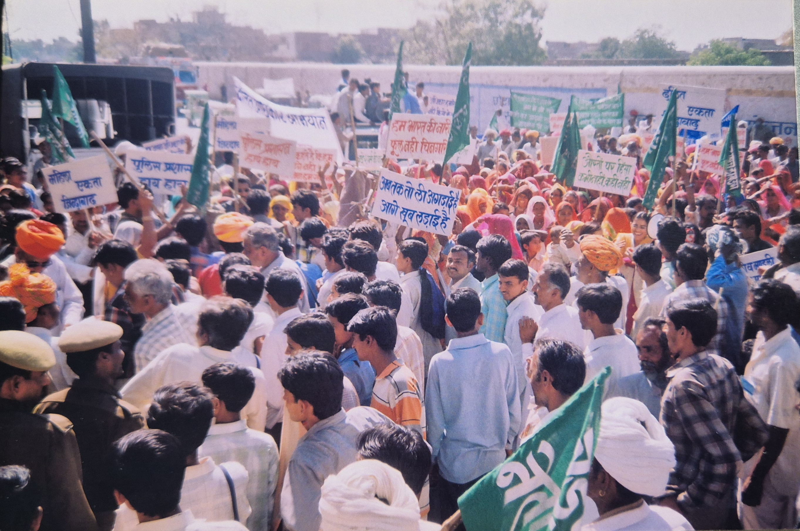
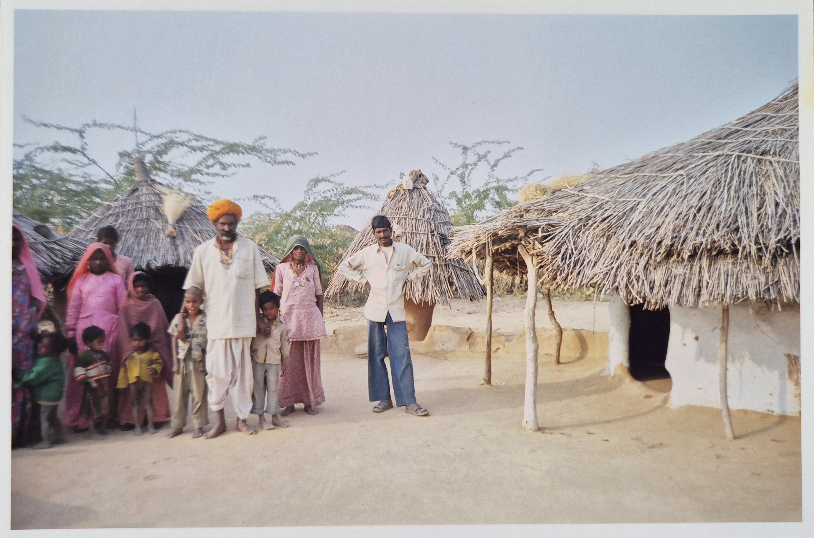
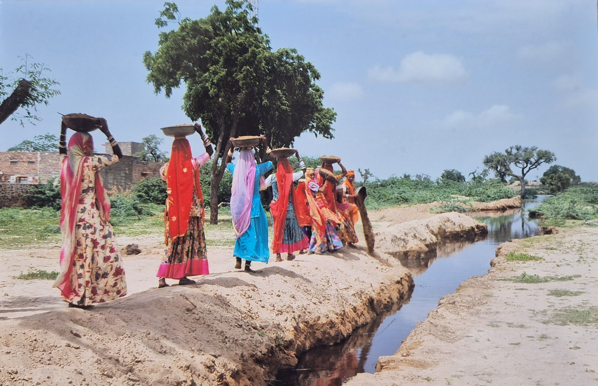
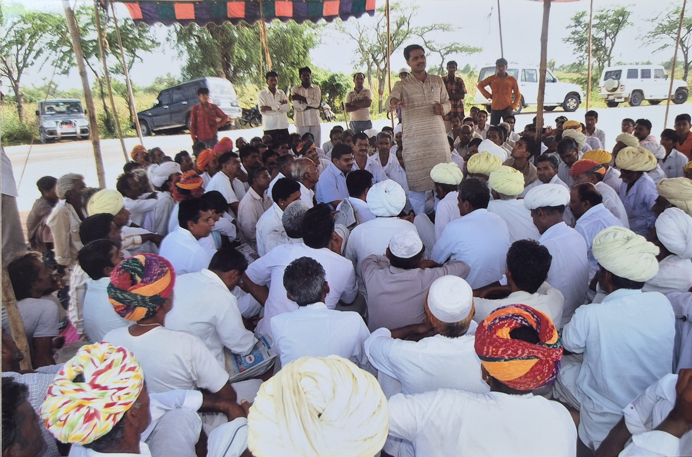

```{=html}

<div id="vssCarousel" class="carousel slide carousel-fade" data-bs-ride="carousel" data-bs-interval="4500" data-bs-pause="false">
  <div class="carousel-indicators">
    <button type="button" data-bs-target="#vssCarousel" data-bs-slide-to="0" class="active"></button>
    <button type="button" data-bs-target="#vssCarousel" data-bs-slide-to="1"></button>
    <button type="button" data-bs-target="#vssCarousel" data-bs-slide-to="2"></button>
    <button type="button" data-bs-target="#vssCarousel" data-bs-slide-to="3"></button>
    <button type="button" data-bs-target="#vssCarousel" data-bs-slide-to="4"></button>
    <button type="button" data-bs-target="#vssCarousel" data-bs-slide-to="5"></button>
  </div>
  <div class="carousel-inner">
    <div class="carousel-item active">
      
      <div class="carousel-caption d-none d-md-block">
        <h2>Rights-Based Work</h2>
        <p>Strengthening marginalized communities to claim their legal rights, challenge caste-based discrimination, and access justice and government entitlements through collective action and advocacy.</p>
      </div>
    </div>
    <div class="carousel-item">
      
      <div class="carousel-caption d-none d-md-block">
        <h2>Livelihood</h2>
        <p>Strengthening sustainable livelihoods of marginalized communities through improved agriculture, livestock support, and better access to land, markets, and government welfare programs.</p>
      </div>
    </div>
    <div class="carousel-item">
      
      <div class="carousel-caption d-none d-md-block">
        <h2>Disaster Management</h2>
        <p>Building community resilience to drought and crises through preparedness, risk reduction, and timely support for the most vulnerable communities.</p>
      </div>
    </div>
    <div class="carousel-item">
      
      <div class="carousel-caption d-none d-md-block">
        <h2>Capacity Building</h2>
        <p>Enhancing the skills, awareness, and leadership capacities of community members and grassroots groups to promote self-reliance and effective participation in development processes.</p>
      </div>
    </div>
    <div class="carousel-item">
      
    </div>
    <div class="carousel-item">
      
    </div>
  </div>
  <button class="carousel-control-prev" type="button" data-bs-target="#vssCarousel" data-bs-slide="prev">
    <span class="carousel-control-prev-icon"></span>
  </button>
  <button class="carousel-control-next" type="button" data-bs-target="#vssCarousel" data-bs-slide="next">
    <span class="carousel-control-next-icon"></span>
  </button>
</div>

<div class="about-home">
  <h2 class="section-title">Vasundhara Sewa Samiti</h2>
  <div class="section-divider"></div>
  
  <p>Vasundhara Sewa Samiti, registered under the Rajasthan State Cooperative/Societies Act, 1958, is a non-governmental, non-profit organization working in the rural and drought-prone regions of <strong>Balotra district, Rajasthan.</strong> The organization has been actively engaged in grassroots development initiatives since its registration, with a strong focus on marginalized, deprived, and vulnerable communities.</p>
  
  <p>Founded with the objective of addressing deep-rooted socio-economic challenges, <span class="org-name-highlight">Vasundhara Sewa Samiti</span> works to empower women, youth, children, scheduled castes, and economically weaker sections by strengthening their capacities, awareness, and access to rights and resources. The organization believes that sustainable development is possible only when communities are enabled to take charge of their own lives and development processes.</p>
  
  <p>Guided by participatory and rights-based approaches, the Samiti implements need-based and locally relevant development interventions in the areas of livelihood promotion, education, disaster risk reduction, institutional development, community capacity building, environmental awareness, and access to government welfare schemes. The organization actively collaborates with government departments, local self-governments, community-based organizations, and civil society partners to ensure inclusive and long-term impact.</p>
  
  <p><span class="org-name-highlight">Vasundhara Sewa Samiti</span> strives to improve the quality of life of rural communities by promoting sustainable livelihoods, social justice, and informed citizenship. By combining traditional community knowledge with practical development strategies, the organization contributes towards inclusive growth and aligns its work with national priorities and the Sustainable Development Goals (SDGs).</p>
  
  <br>
  <a href="about.html" class="btn-vss">Read More About Us</a>&nbsp;&nbsp;
  <a href="contact.html" class="btn-vss-outline">Contact Us</a>
</div>

<div class="focused-areas-section">
  <h2 class="section-title">Focused Thematic Areas of Vasundhara Sewa Samiti</h2>
  <div class="section-divider"></div>
  
  <div class="container-fluid px-4 mt-5">
    <div class="row g-4 align-items-center text-center">
      <div class="col-12">
        <div class="focused-area-card p-0">
          <div class="circle-img-wrapper mx-auto mb-2">
            
          </div>
          <h4 class="area-title mb-2">Right Based</h4>
          <p class="area-desc text-center mx-auto" style="max-width: 800px; font-size: 1.1rem; line-height: 1.6;">In western Rajasthan, Dalits and marginalized communities face a dual exclusion: they are physically distant from government services, and socially denied the rights that legally belong to them. Caste-based discrimination continues in schools and public spaces.</p>
        </div>
      </div>
      
      <div class="col-12">
        <div class="focused-area-card p-0">
          <div class="circle-img-wrapper mx-auto mb-2">
            
          </div>
          <h4 class="area-title mb-2">Livelihood</h4>
          <p class="area-desc text-center mx-auto" style="max-width: 800px; font-size: 1.1rem; line-height: 1.6;">Promoting sustainable livelihoods through skills training, local planning, and connecting families with support schemes. We focus on agriculture, animal husbandry, and vocational training to ensure economic stability for rural households.</p>
        </div>
      </div>
      
      <div class="col-12">
        <div class="focused-area-card p-0">
          <div class="circle-img-wrapper mx-auto mb-2">
            
          </div>
          <h4 class="area-title mb-2">Disaster Management</h4>
          <p class="area-desc text-center mx-auto" style="max-width: 800px; font-size: 1.1rem; line-height: 1.6;">Building preparedness and community response capacity to reduce disaster risk and protect vulnerable families. We work on drought mitigation, water conservation, and emergency relief distribution during crises.</p>
        </div>
      </div>

      <div class="col-12">
        <div class="focused-area-card p-0">
          <div class="circle-img-wrapper mx-auto mb-2">
            
          </div>
          <h4 class="area-title mb-2">Capacity Building</h4>
          <p class="area-desc text-center mx-auto" style="max-width: 800px; font-size: 1.1rem; line-height: 1.6;">Strengthening institutions, community leaders, and grassroots workers through training and mentoring. We empower local governance structures and community-based organizations to function effectively and democratically.</p>
        </div>
      </div>
    </div>
  </div>
</div>


<div style="padding:60px 30px;background:#fff;text-align:center;">
  <div class="container" style="max-width:700px;margin:0 auto;">
    <div class="donate-box">
      <h4>🤝 Help Us | हमारी मदद करें</h4>
      <p>Your support helps Vasundhara Sewa Samiti continue its work with marginalized communities in Balotra, Rajasthan. You can contribute through donations or volunteering your time and skills.</p>
      <a href="donation.html" class="btn-donate">Donate / Volunteer</a>
    </div>
  </div>
</div>
```
