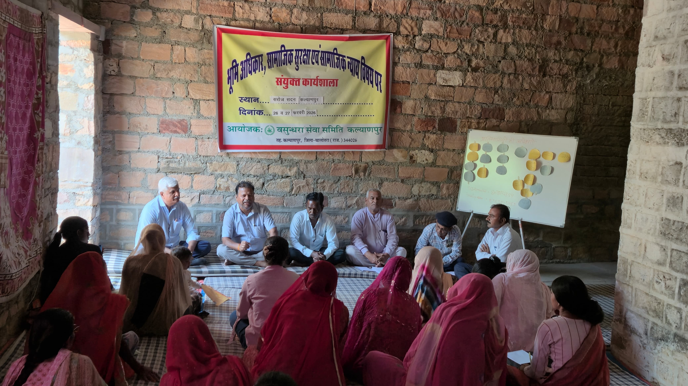

```{=html}
<div class="mission-hero">
  <div class="mission-hero-inner">
    <h2 class="mission-hero-title">Mission and Vision</h2>
  </div>
</div>

<div class="focus-wrapper">
  <div class="about-container">
    <div class="about-intro-text reveal">
      <h3 style="color: #1a5c2a; margin-bottom: 1rem;">Our Vision</h3>
      <div class="focus-subtitle-wrapper" style="border-top: none; padding-top: 0;">
         <p style="font-size: 1.1rem; font-weight: 500;">To build an inclusive, just, and sustainable society where marginalized and rural communities are empowered, self-reliant, and able to lead dignified lives with equal access to opportunities, resources, and rights.</p>
      </div>
      
      <h3 style="color: #1a5c2a; margin-bottom: 1rem; margin-top: 2rem;">Our Mission</h3>
      <div class="focus-subtitle-wrapper" style="border-top: none; padding-top: 0;">
        <p>To raise awareness and organize economically, socially, educationally, culturally, physically, and politically weaker sections, Dalits, women, the helpless, disabled, exploited, and deprived communities about their rights and entitlements, and to develop their own capabilities so that their intellectual and skill development can take place, enabling them to live life with self-respect.</p>
      </div>
    </div>
    
    <div class="about-intro-image reveal">
      
    </div>
  </div>
</div>

<script>
  function reveal() {
    var reveals = document.querySelectorAll(".reveal");
    for (var i = 0; i < reveals.length; i++) {
      var windowHeight = window.innerHeight;
      var elementTop = reveals[i].getBoundingClientRect().top;
      var elementVisible = 150;
      if (elementTop < windowHeight - elementVisible) {
        reveals[i].classList.add("active");
      }
    }
  }
  window.addEventListener("scroll", reveal);
  // Trigger once on load
  reveal();
</script>
```
