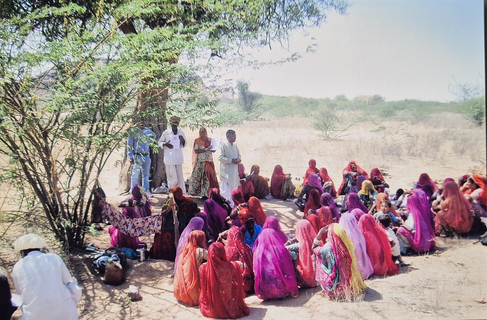

```{=html}
<div class="secretary-hero">
  <div class="about-hero-inner">
    <h2 class="about-hero-title">Secretary Desk</h2>
  </div>
</div>

<section class="secretary-shell">
  <div class="secretary-card reveal">
    <div class="secretary-photo">
      
    </div>
    <div class="secretary-copy">
      <div class="secretary-quote-mark">“</div>
      <h3>Over the past 29+ years, our understanding, knowledge, skills, and awareness of local conditions have gradually grown.</h3>
      <div class="section-divider"></div>
      <p>While presenting the progress of Vasundhara Sewa Samiti's work, I am pleased that, when the organization was established, we did not have a clear understanding of how to systematically move our work forward. However, through the development work carried out over the past 29+ years, our understanding, knowledge, skills, and awareness of local conditions have gradually grown.</p>
      <p>In efforts to advance social change and system transformation, our colleagues have provided valuable guidance, suggestions, timely cooperation, and references. The workers have worked day and night with great dedication to collect and compile information, through which we are moving forward towards achieving our mission. For this, I am grateful on behalf of the organization family.</p>
      <p>In this process, the organization's activities in its working area have been carried out with the aspirations, expectations, and needs of the local people in mind, and with their shared participation and decision-making roles, efforts have been made to implement them with a collective understanding.</p>
      <p>I hope this process continues in the future as well.</p>
      <div class="secretary-signoff">
        <span>With this hope and belief, Best wishes.</span>
        <strong>P. R. Barupal</strong>
        <em>Secretary</em>
        <small>Vasundhara Sewa Samiti, Kalyanpur</small>
      </div>
    </div>
  </div>
</section>

<script>
  function reveal() {
    var reveals = document.querySelectorAll(".reveal");
    for (var i = 0; i < reveals.length; i++) {
      var windowHeight = window.innerHeight;
      var elementTop = reveals[i].getBoundingClientRect().top;
      var elementVisible = 150;
      if (elementTop < windowHeight - elementVisible) {
        reveals[i].classList.add("active");
      }
    }
  }
  window.addEventListener("scroll", reveal);
  // Trigger once on load
  reveal();
</script>
```
